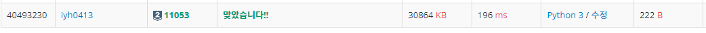
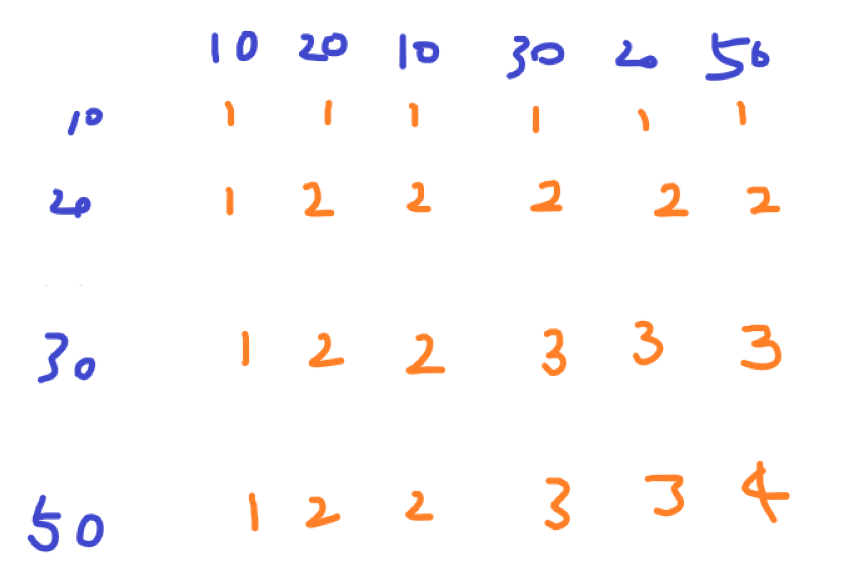
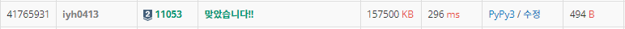

# [Baekjoon] 11053. 가장 긴 증가하는 부분 수열 [S2]

## 📚 문제

https://www.acmicpc.net/problem/11053

---

## 📖 DP 풀이

가장 긴 증가하는 부분 수열은 DP Well known 문제이다.

n이 1000이므로 for문을 2번 돌려도 가능하니 완전탐색으로 해결한다.

입력 받은 수열을 첫번째 인덱스부터 확인하며 메모이제이션 배열에 넣어준다.

부분 수열의 최소 길이는 자기 자신인 1이니 1로 메모이제이션을 초기화 한다.

예제로 비교한다.

- Input

> 6
> 10 20 10 30 20 50

먼저 dp를 1로 초기화한다.

| Index | 0    | 1    | 2    | 3    | 4    | 5    |
| ----- | ---- | ---- | ---- | ---- | ---- | ---- |
| arr   | 10   | 20   | 10   | 30   | 20   | 50   |
| dp    | 1    | 1    | 1    | 1    | 1    | 1    |

Index 1부터 이전의 값이 있으니 Index 1부터 확인한다.

Index 0의 배열 값이 Index 1보다 작으니 Index 0의 dp 값에 1을 더한 값을 넣어준다.

| Index | 0    | 1    | 2    | 3    | 4    | 5    |
| ----- | ---- | ---- | ---- | ---- | ---- | ---- |
| arr   | 10   | 20   | 10   | 30   | 20   | 50   |
| dp    | 1    | 2    | 1    | 1    | 1    | 1    |

Index 2는 이전의 값 중 더 작은 값이 없으니 dp는 1이다.

| Index | 0    | 1    | 2    | 3    | 4    | 5    |
| ----- | ---- | ---- | ---- | ---- | ---- | ---- |
| arr   | 10   | 20   | 10   | 30   | 20   | 50   |
| dp    | 1    | 2    | 1    | 1    | 1    | 1    |

Index 3은 이전의 모든 값들이 다 작다. 따라서 dp값이 가장 큰 Index 1의 dp 값인 2에다가 1을 더해 넣어준다.

| Index | 0    | 1    | 2    | 3    | 4    | 5    |
| ----- | ---- | ---- | ---- | ---- | ---- | ---- |
| arr   | 10   | 20   | 10   | 30   | 20   | 50   |
| dp    | 1    | 2    | 1    | 3    | 1    | 1    |

Index 4보다 작은 Index는 0과 2이다. 따라서 둘다 dp가 1이니 1 더한 2를 넣어준다.

| Index | 0    | 1    | 2    | 3    | 4    | 5    |
| ----- | ---- | ---- | ---- | ---- | ---- | ---- |
| arr   | 10   | 20   | 10   | 30   | 20   | 50   |
| dp    | 1    | 2    | 1    | 3    | 2    | 1    |

Index 5는 모든 수가 다 작다. 따라서 dp값이 가장 큰 Index 3의 dp 값인 3에다가 1을 더해 넣어준다.

| Index | 0    | 1    | 2    | 3    | 4    | 5    |
| ----- | ---- | ---- | ---- | ---- | ---- | ---- |
| arr   | 10   | 20   | 10   | 30   | 20   | 50   |
| dp    | 1    | 2    | 1    | 3    | 2    | 4    |

다음 dp 값들 중 최댓값을 출력한다.

## 📒 DP 코드

```python
n = int(input())
arr = list(map(int, input().split()))
dp = [1 for _ in range(n)]

for i in range(n):
    for j in range(i):
        if arr[i] > arr[j]:
            dp[i] = max(dp[i], 1 + dp[j])
            
print(max(dp))
```

## 🔍 DP 결과



---

## 📖 탑다운 DP 풀이

탑다운 DP를 적용해서 풀어본다. 탑다운 DP를 적용하기 위해 입력으로 받는 값들을 중복 제거 후 정렬하여 작은 수부터 넣어준다.

이 때 점화식으로 생각해보면,

현재 확인하는 값이 수열의 수와 같으면 대각선 왼쪽 위 값과 바로 위 값을 비교해서 넣어준다.

확인하는 값이 수열의 수와 다르면, 왼쪽 값과 위쪽 값을 비교해서 넣어준다.

즉, LCS와 비슷하다.

그림으로 표현하면 다음과 같다.



두 번째 줄에서 20이 나올 때 왼쪽 위 대각선 값인 1에 1을 더한 값과 위의 값인 1과 비교해 더 큰 값을 넣어준다.

값이 다른 경우는 왼쪽과 위쪽을 비교해서 큰 값으로 채워나가면 된다.

행을 왼쪽부터 다 진행한 후 다음 행을 확인한다.

## 📒 DP 탑다운 코드

```python
import sys
sys.setrecursionlimit(10000)

def recur(x, y):
    if x < 0 or y < 0:	# 배열의 왼쪽과 위쪽을 초과한 경우 0을 리턴
        return 0
    if dp[x][y] != -1:	# dp에 값이 있는 경우는 있는 값 리턴
        return dp[x][y]
    ret = 0
    if arr2[x] == arr[y]:	# x와 y값이 같은 경우
        ret = max(recur(x - 1, y - 1) + 1, recur(x - 1, y))	# 왼쪽 위 대각선에 1을 더한 값과 위쪽 값을 비교 
    else:	# x와 y값이 다른 경우
        ret = max(recur(x, y - 1), recur(x - 1, y))	# 왼쪽과 위쪽을 비교
    dp[x][y] = ret
    return ret


n = int(input())
arr = list(map(int, input().split()))
arr2 = sorted(set(arr))	# 중복 제거 후 정렬
m = len(arr2)
dp = [[-1] * n for _ in range(m)]	# 확인하는 값을 적어준다.
print(recur(m - 1, n - 1))
```

## 🔍 DP 탑다운 결과



