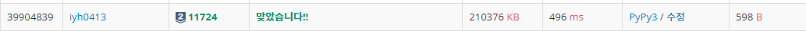

# [Baekjoon] 11724. 연결 요소의 개수 [S2]

## 📚 문제

https://www.acmicpc.net/problem/11724

----

방향 없는 그래프 문제이다.

간선으로 연결된 정점들을 하나의 연결요소로 생각한다. 서로 연결되지않는 연결요소들의 개수를 구하는 문제이다.

**단일 노드도 카운팅해줘야 한다..** 이걸로 오랫동안 고민했다.😢

**BFS 탐색**으로 푼다. 간선을 하나씩 확인하며 연결되어있는 간선을 모두 탐색하고 카운트를 하나씩 증가시킨다.

## 📒 코드

```python
from collections import deque
import sys

input = sys.stdin.readline
n, e = map(int, input().split())
arr = [[] for _ in range(n + 1)]
visited = [0 for _ in range(n + 1)]     # 방문한 정점인지 파악

for _ in range(e):  # arr 배열에 연결상태 표시
    v1, v2 = map(int, input().split())
    arr[v1].append(v2)
    arr[v2].append(v1)

queue = deque()
cnt = 0       # 연결 요소 개수 카운팅
for i in range(1, n + 1):
    if visited[i] == 0:     # 아직 등장한 노드가 아니면 세준다, 단일 노드도 하나의 연결 요소
        queue.append(i)     # 큐에 넣어준다.
        cnt += 1            # 연결 요소 개수 카운팅
        while queue:        # 큐에 값이 없을 때까지 반복
            v = queue.popleft()     # 큐에서 정점을 하나씩 꺼낸다.
            if visited[v] == 0:     # 이미 나온 정점인지 확인
                visited[v] = 1      # 나왔음을 표시
                for next_v in arr[v]:   # 정점에 연결된 정점들을 큐에 넣는다.
                    queue.append(next_v)
print(cnt)

```

## 🔍 결과

