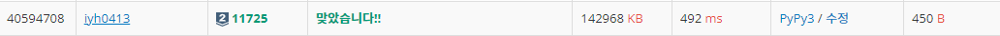

# [Baekjoon] 11725. 트리의 부모 찾기 [S2]

## 📚 문제

https://www.acmicpc.net/problem/11725

---

방향이 없는 그래프를 연결하는 2차원 배열을 만든다.

부모 노드의 배열을 초기화한다.

BFS로 탐색한다. 먼저 트리의 루트노드인 1을 큐에 담는다.

1부터 꺼내어 확인하며 자식 노드들의 부모 노드 값을 1로 바꿔준다.

각각의 값들을 꺼내 각각 연결되어 있는 노드들의 부모 노드 값을 큐에서 꺼낸 값으로 넣어준다.

이미 확인한 값들은 다시 확인하지 않게 0보다 큰 값이 부모 노드에 들어있으면 continue로 다음으로 넘어간다.

## 📒 코드

```python
from collections import deque


n = int(input())
arr = [[] for _ in range(n + 1)]

for i in range(n - 1):
    v1, v2 = map(int, input().split())
    arr[v1].append(v2)
    arr[v2].append(v1)

par = [0 for _ in range(n + 1)]

queue = deque()
queue.append(1)
par[1] = -1
while queue:
    v = queue.popleft()
    for v2 in arr[v]:
        if par[v2] == 0:
            queue.append(v2)
            par[v2] = v

for i in range(2, n + 1):
    print(par[i])
```

## 🔍 결과

