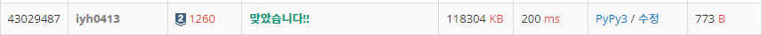

# [Baekjoon] DFS와 BFS [S2]

## 📚 문제 : [DFS와 BFS](https://www.acmicpc.net/problem/1260)

## 📖 풀이

DFS와 BFS 문제이다.

두 정점 사이에 여러 개의 간선이 나올 수 있는 그래프 문제는 중복을 제거해주기 위해 set 자료형을 사용한다.

작은 순서대로 DFS, BFS 탐색을 해야하니 set 자료형을 인접리스트 형태로 바꿔주는데 오름차순으로 정렬한다.

DFS와 BFS를 탐색하면서, 결과값을 따로 리스트에 저장해주고 다 돌고난 후 출력한다.

## 📒 코드

```python
from collections import deque


def dfs(x):         # dfs 탐색
    visited[x] = 1
    result.append(x)
    for nxt in graph[x]:
        if visited[nxt]:
            continue
        dfs(nxt)


n, m, v = map(int, input().split())
graph = [set() for _ in range(n + 1)]   # 인접리스트로 표현하기 앞서 중복제거를 위해 set() 사용

for i in range(m):
    a, b = map(int, input().split())    
    graph[a].add(b)                     # 두 정점 사이에 여러 개의 간선이 나올 수 있으니 중복 제거
    graph[b].add(a)

for i in range(n + 1):                  # 숫자가 작은 순으로 탐색해야하니 리스트로 형변환 후 정렬
    graph[i] = sorted(list(graph[i]))

visited = [0 for _ in range(n + 1)]
result = []
dfs(v)
print(*result)

visited = [0 for _ in range(n + 1)]
que = deque()
que.append(v)
visited[v] = 1
result = [v]

while que:                  # bfs 탐색
    node = que.popleft()
    for nxt in graph[node]:
        if visited[nxt]:
            continue
        visited[nxt] = 1
        result.append(nxt)
        que.append(nxt)

print(*result)
```

## 🔍 결과

