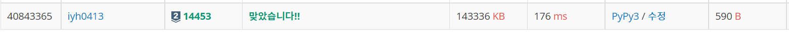

# [Baekjoon] 14453. Hoof, Paper, Scissors (Silver) [S2]

## 📚 문제

https://www.acmicpc.net/problem/14453

---

N이 100000이라 O(n^2)으로 해결하려고 하면 시간초과가 난다.

**누적합**을 사용하여 O(n)으로 해결한다.

H가 바위, P가 보, S가 가위이다.

H, P, S의 누적합을 인덱스 별로 각각 2차원 배열에 담는다.

누적합을 첫번째 인덱스부터 탐색한다. 

주먹 가위 보 중 2개를 뽑는다. 중복 없는 순열

> (H, P), (H, S), (P, H), (P, S), (S, H), (S, P)

A와 B를 뽑았으면 A의`[0, i]` 누적합에  B의`[i + 1 , n]` 누적합을 더한다.

누적합을 구했으니 A는 확인한 인덱스 값을 더하면 되고 B는 [-1]인 끝 인덱스에서 현재 인덱스를 빼준다.

모든 인덱스에서 확인하면 O(n)으로 탐색할 수 있다.

## 📒 코드

```python
import sys
input = sys.stdin.readline

n = int(input())
arr = [0] + [input().rstrip() for _ in range(n)]
prefix = [[0, 0, 0] for _ in range(n + 1)]  # P, H, S

for i in range(1, n + 1):
    if arr[i] == 'P':
        prefix[i][0] += 1
    elif arr[i] == 'H':
        prefix[i][1] += 1
    else:
        prefix[i][2] += 1
    for j in range(3):
        prefix[i][j] += prefix[i - 1][j]

result = 0
for i in range(1, n + 1):
    for j in range(3):
        for k in range(3):
            if j != k:
                result = max(result, prefix[i][j] + prefix[-1][k] - prefix[i][k])
print(result)
```

## 🔍 결과




