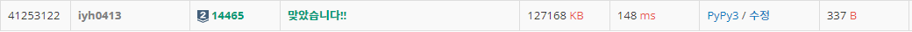

# [Baekjoon] 14465. 소가 길을 건너간 이유 5 [S2]

## 📚 문제

https://www.acmicpc.net/problem/14465

---

## 📖 풀이

슬라이딩 윈도우를 활용한다.

k의 범위 안에 고장난 신호등의 개수가 가장 적을 때의 개수를 찾으면 되니 s = 1, e = k로 시작해서 s와 e를 함께 움직여 동일한 k 범위 내에서 고장난 신호등의 개수를 세면 된다.

범위가 일정하니 e가 이동하면 이동한 배열을 추가하고 s가 이동할 땐 지나간 배열을 뺀다.

k의 범위가 커도 앞 뒤로 더하고 빼주기만 하면 된다.

예제를 표로 보면

- Input

> ```
> 10 6 5
> 2
> 10
> 1
> 5
> 9
> ```

| 1    | 2    | 3    | 4    | 5    | 6    | 7    | 8    | 9    | 10   |
| ---- | ---- | ---- | ---- | ---- | ---- | ---- | ---- | ---- | ---- |
| x    | x    | o    | o    | x    | o    | o    | o    | x    | x    |
| s    |      |      |      |      | e    |      |      |      |      |

k가 6이니 s는 1 e는 6에서 시작한다.

처음에 1부터 6사이에 고장난 신호등의 개수를 담는다. 현재 개수는 3이다.

cnt = 3, min_cnt = 3


| 1    | 2    | 3    | 4    | 5    | 6    | 7    | 8    | 9    | 10   |
| ---- | ---- | ---- | ---- | ---- | ---- | ---- | ---- | ---- | ---- |
| x    | x    | o    | o    | x    | o    | o    | o    | x    | x    |
|      | s    |      |      |      |      | e    |      |      |      |

s와 e가 한 칸씩 전진한다. 이 때 1번 신호등이 고장났으면 고장난 신호등의 개수를 하나 줄인다.

7번 신호등이 고장났으면 신호등의 개수를 하나 늘리는데 고장나지 않았으므로 이 때는 변하지 않는다.

즉 현재 개수는 2개로 바뀐다.

cnt = 2, min_cnt = 2


| 1    | 2    | 3    | 4    | 5    | 6    | 7    | 8    | 9    | 10   |
| ---- | ---- | ---- | ---- | ---- | ---- | ---- | ---- | ---- | ---- |
| x    | x    | o    | o    | x    | o    | o    | o    | x    | x    |
|      |      | s    |      |      |      |      | e    |      |      |

s와 e가 한 칸씩 전진한다. 2번 신호등이 고장 났으니 하나 줄인다.

8번 신호등이 고장 나지 않았으니 바뀌지 않는다. 현재 고장난 신호등의 개수는 총 1개로 바뀐다.

cnt = 1, min_cnt = 1


| 1    | 2    | 3    | 4    | 5    | 6    | 7    | 8    | 9    | 10   |
| ---- | ---- | ---- | ---- | ---- | ---- | ---- | ---- | ---- | ---- |
| x    | x    | o    | o    | x    | o    | o    | o    | x    | x    |
|      |      |      | s    |      |      |      |      | e    |      |

s와 e가 한 칸씩 전진한다. 3번 신호등이 고장나지 않았으니 변하지 않는다.

9번 신호등이 고장 났으니 하나 더한다. 현재 고장난 신호등의 개수는 총 2개로 바뀐다.

최소 cnt 값은 변하지 않는다.

cnt = 2, min_cnt = 1


| 1    | 2    | 3    | 4    | 5    | 6    | 7    | 8    | 9    | 10   |
| ---- | ---- | ---- | ---- | ---- | ---- | ---- | ---- | ---- | ---- |
| x    | x    | o    | o    | x    | o    | o    | o    | x    | x    |
|      |      |      |      | s    |      |      |      |      | e    |

s와 e가 한 칸씩 전진한다. 4번 신호등이 고장나지 않았으니 변하지 않는다.

10번 신호등이 고장 났으니 하나 더한다. 현재 고장난 신호등의 개수는 총 3개로 바뀐다.

최소 cnt 값은 변하지 않는다.

cnt = 3, min_cnt = 1

최종 최소 cnt 값은 1이다.

## 📒 코드

```python
n, k, b = map(int, input().split())
arr = [0 for _ in range(n + 1)]
for i in range(b):
    arr[int(input())] = 1

s = 1
e = k
min_cnt = 0
for i in range(s, e + 1):
    if arr[i] == 1:
        min_cnt += 1
cnt = min_cnt
while e < n:
    cnt -= arr[s]
    s += 1
    e += 1
    cnt += arr[e]
    min_cnt = min(cnt, min_cnt)

print(min_cnt)
```

## 🔍 결과

