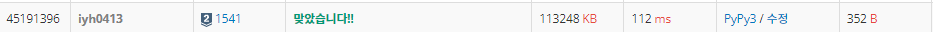

# [Baekjoon] 1541. 잃어버린 괄호 [S2]

## 📚 문제 : [잃어버린 괄호](https://www.acmicpc.net/problem/1541)

## 📖 풀이

괄호로 최소의 답을 출력한다.

예시로 적어보면,

55 - 50 + 40 - 20 + 30 + 10 - 20

55 - (50 + 40) - (20 + 30 + 10) - 20

빼기가 나온 순간부터 뒤 쪽은 다 빼기로 바꿀 수 있다.

minus 변수를 선언해 minus가 나온 시점부터 뒤에 수들은 뺀다.

숫자가 나오면 num 변수에 string으로 담는다.

기호가 나오거나 수식을 다 확인한 경우 num을 int로 형변환 후 result에 더해준다.

이 때 minus가 1이면 빼주고, 0이면 더해준다.

## 📒 코드

```python
string = input()
num = ''
result = 0
minus = 0
for c in string:
    if c in '-+':
        if minus:
            result -= int(num)
        else:
            result += int(num)
        num = ''
    else:
        num += c
    if c == '-':
        minus = 1
else:
    if minus:
        result -= int(num)
    else:
        result += int(num)
print(result)
```

## 🔍 결과

