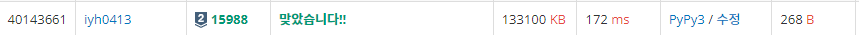

# [Baekjoon] 15988. 1, 2, 3 더하기 3 [S2]

## 📚 문제

https://www.acmicpc.net/problem/15988

---

저번 1, 2, 3 더하기는 백트래킹 방식으로 풀었는데 지금은 n이 너무 커 재귀를 사용하면 recursion error가 발생한다. 따라서 DP방식으로 해결한다.

DP로 해결하기 위해 점화식으로 작성한다.

num[n]은 n에서 나올 수 있는 1, 2, 3의 조합의 개수이다.

> num[n] + num[n+1] + num[n+2] = num[n+3]

위와같이 작성할 수 있다.

따라서 현재 그 수가 나오지 않았을 경우 반복문을 돌며 DP를 순서대로 채워주고 DP에 그 수가 등장하면 출력한다.

다음 테스트 케이스들은 이전에 봤던 수들은 봤으니 제외하고 그 뒤부터 확인한다.

## 📒 코드

```python
T = int(input())
dp = [0 for _ in range(1000005)]
dp[1] = 1
dp[2] = 2
dp[3] = 4
s = 4
for i in range(T):
    n = int(input())
    while s <= n:
        for i in range(1, 4):
            dp[s] += dp[s - i]
            dp[s] %= 1000000009
        s += 1
    print(dp[n])
```

## 🔍 결과

