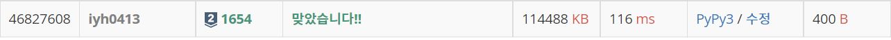

# [Baekjoon] 1654. 랜선 자르기 [S2]

## 📚 문제 : [랜선 자르기](https://www.acmicpc.net/problem/1654)

## 📖 풀이

이진탐색(매개변수 탐색)을 활용한다.

자르는 랜선의 길이를 매개변수 x로 삼는다.

x로 n개를 만들 수 있으면 o, 만들 수 없으면 x이다.

예를 들어 길이가 4일 때까지 n개를 만들 수 있다면 아래와 같이 나온다.

x : 1 2 3 4 5 6 7 8 9 ...

​     o o o o x x x x x x x x x ...

따라서 이진탐색을 할 때 결과가 O이면 최대한 더 긴 값을 찾아야하니 앞부분을 자르고, X이면 값을 차자야하니 뒷부분을 자른다.

## 📒 코드

```python
import sys
input = sys.stdin.readline

def check(x):
    result = 0
    for i in range(k):
        result += arr[i] // x
    return True if result >= n else False


k, n = map(int, input().split())
arr = [int(input()) for _ in range(k)]

s = 0
e = 2 ** 31
ans = -1
while s <= e:
    mid = (s + e) // 2
    if check(mid):
        ans = mid
        s = mid + 1
    else:
        e = mid - 1

print(ans)
```

## 🔍 결과

