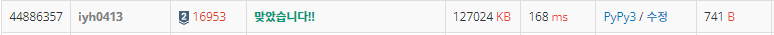

# [Baekjoon] 16953. A → B [S2]

## 📚 문제 : [A → B](https://www.acmicpc.net/problem/16953)

## 📖 풀이

A를 B로 바꾸는 문제이다.

바꾸는 규칙은 다음과 같다.

> 1. 2를 곱한다.
> 2. 1을 수의 가장 오른쪽에 추가한다.

BFS를 활용해서 해결한다. visited 배열을 만들어 확인했던 값이 나오면 갱신하지 않는다.

visited 배열에 최소값을 담으며 원하는 B 값이 나온 경우 그 때의 연산 횟수를 출력한다.

visitied 배열을 활용한 BFS로 푸려고 하면 **메모리 초과**가 발생한다. 왜냐면 범위가 10 ^ 9로 넓기 때문이다.

카운팅 배열로 10억개를 선언하면 시간초과가 발생하기 때문에 배열을 선언하지 않고 해결해야한다.

카운팅 배열이 아니라 딕셔너리로 확인한다.

set도 해시테이블이라서 사용할 수 있지만 cnt를 1씩 증가시키며 확인하기 위해 딕셔너리를 사용했다.

## 📒 코드

```python
from collections import deque

def bfs():
    que = deque()
    que.append(a)
    dic[a] = 1  # 최소 연산 횟수에 1을 더하라 했으므로 시작값은 1이다.
    while que:
        v = que.popleft()
        if v == b:          # b가 나온 경우
            return dic[b]
        if v * 2 <= b and not dic.get(v * 2):     # 나오지 않은 값인 경우
            dic[v * 2] = dic[v] + 1
            que.append(v * 2)                   # que에 담아준다.
        if v * 10 + 1 <= b and not dic.get(v * 10 + 1):    # 1을 붙인 수의 연산횟수가 더 작아지면 변경
            dic[v * 10 + 1] = dic[v] + 1
            que.append(v * 10 + 1)
    return -1

a, b = map(int, input().split())
dic = {}
print(bfs())
```

## 🔍 결과

