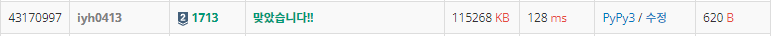

# [Baekjoon] 1713. 후보 추천하기 [S2]

## 📚 문제 : [후보 추천하기](https://www.acmicpc.net/problem/1713)

## 📖 풀이

사진틀에 학생들의 추천을 받은 사진들을 채운다.

사진틀의 크기가 정해져있다.

1. 사진틀에 추천한 사진이 있으면 추천 수를 1 증가시킨다.
2. 사진틀에 추천한 사진이 없는 경우
   1. 사진틀이 꽉찬 경우는 추천 수가 가장 작은 사진 들 중 오래된 사진을 제거하고 새로운 사진을 추가한다.
   2. 사진틀이 꽉 차지 않았으면 새로운 사진을 추가만 한다.

추천틀에 `[추천 수, 학생 번호]`로 값을 넣어준다. 그러면 추천 수가 작은 순으로 정렬하기 쉽다.

최근에 게시된 것인지 나중에 게시된 것인지는 새로운 사진을 맨 오른쪽으로 append()하여 게시된 순서를 알 수 있다.

추천 수가 가장 작은 사진을 찾기 위해 추천 수로 정렬하여 그 때의 추천 수 값을 저장한다.

오래된 게시글부터 확인하며 위에서 구한 가장 작은 추천 수와 같으면 그 게시물을 삭제한다.

삭제하면 새로운 게시글을 맨 오른쪽에 append한다.


## 📒 코드

```python
n = int(input())
m = int(input())
arr = list(map(int, input().split()))
result = []

for i in range(m):
    pick = arr[i]
    for j in range(len(result)):
        if result[j][1] == pick:
            result[j][0] += 1
            break
    else: 
        if len(result) == n:
            mmin = sorted(result)[0][0]
            for j in range(len(result)):
                if mmin == result[j][0]:
                    result.pop(j)
                    result.append([1, pick])
                    break
        else:
            result.append([1, pick])

result = list(map(lambda x: x[1], result))
print(*sorted(result))
```

## 🔍 결과

