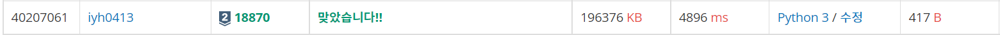
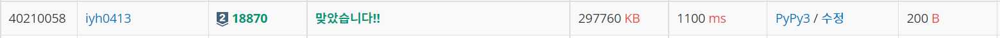

# [Baekjoon] 18870. 좌표 압축 [S2]

## 📚 문제

https://www.acmicpc.net/problem/18870

---

0부터 숫자를 매기는데 가장 작은 수는 0, 그 뒤부터 1,2,3.. 같은 수는 같은 다 같은 number로 설정한다.

>ex). 
>
>입력: 2 4 -10 4 -9
>
>압축 결과 => 2 3 0 3 1

입력에 대한 조건을 보면 N의 값이 백만이다. 그러면 for문을 2번 돌면 안된다.

먼저 입력된 값을 list에 넣어준다. 이 때 현재 인덱스 값을 포함하는 2차원 리스트로 나타낸다.

> `[[2, 0], [4, 1], [-10, 2], [4, 3], [-9, 4]]`

수를 첫번째 인덱스로 오름차순으로 정렬하여 따로 담는다.

> `[[-10, 2], [-9, 4], [2, 0], [4, 1], [4, 3]]`

첫번째 인덱스를 순차적으로 확인하면서 0부터 순차적으로 값을 바꿔준다.

같은 값이 나오면 같은 숫자를 넣어준다.

> `[[0, 2], [1, 4], [2, 0], [3, 1], [3, 3]]`

이걸 다시 두번째 인덱스로 정렬한다.

> `[[2, 0], [3, 1], [0, 2], [3, 3] ,[1, 4]]`

첫번째 인덱스 값을 출력한다.

> 2 3 0 3 1

## 📒 코드

```python
n = int(input())
arr = list(map(int, input().split()))

for i in range(n):	# 값과 인덱스를 리스트로 묶어 2차원으로 넣어준다.
    arr[i] = [arr[i], i]

arr.sort()			# 배열을 값으로 정렬한다.

prev = arr[0][0]	# 이전의 값 저장
cnt = 0				# 바꿀 값
arr[0][0] = cnt		# 0번째 값을 바꾸어준다.
for i in range(1, n):
    if arr[i][0] == prev:	# 이전의 값과 같을 땐 같은 값을 넣어준다.
        arr[i][0] = cnt
    else:				# 다를 땐 1을 더한 값을 넣어준다.
        cnt += 1
        prev = arr[i][0]	# 비교할 이전 값을 바꾸어준다.
        arr[i][0] = cnt
        

arr.sort(key=lambda x : x[1])	# 다시 인덱스 순으로 정렬한다.
result = []
for i in range(n):				# 값으로만 프린트하기 위해 result에 다시 담아준다.
    result.append(arr[i][0])

print(*result)
```

## 🔍 결과



시간이 꽤 오래 걸린다.

---

enumerate와 set, 딕셔너리 자료구조를 활용해서 풀어본다.

입력: 2 4 -10 4 -9

입력을 list에 담는다.

> `[2, 4, -10, 4, -9]`

입력을 set자료구조로 중복을 없앤 후 다시 list로 바꿔 정렬시켜준다.

> `[-10, -9, 2, 4]`

list의 enumerate를 순회하며 인덱스 값을 value, list에 들어있는 값을 key로 집어 넣는다.

> `{ -10 : 0, -9 : 1, 2 : 2, 4: 3}`

처음에 담았던 리스트를 순회하며 입력값을 key로하여 value값으로 바꿔준다.

> `[2, 3, 0, 3, 1]`

## 📒 코드

```python
n = int(input())
arr = list(map(int, input().split()))
arr2 = sorted(list(set(arr)))	# set로 중복을 제거하고 정렬한다.
dic = {}

for k, v in enumerate(arr2):	# enumerate의 인덱스와 값을 각각 딕셔너리의 값과 key에 매칭해준다.
    dic[v] = k
    
for i in range(n):			# 입력받았던 배열을 딕셔너리를 활용해 바꾸어준다.
    arr[i] = dic[arr[i]]

print(*arr)
```

## 🔍 결과



시간이 많이 단축~~⏰