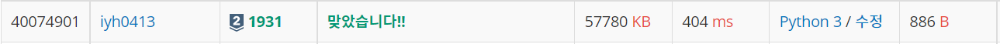
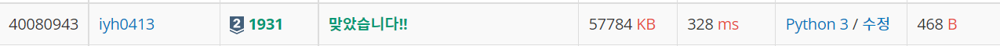

# [Baekjoon] 1931. 회의실 배정 [S2]

## 📚 문제

https://www.acmicpc.net/problem/1931

---

**정렬 + stack + 재귀를 활용한 조합**으로 해결했다.

먼저 회의를 끝나는 시간 -> 시작하는 시간 순으로 정렬한다.

예제로 들어오는 입력을 보면 아래와 같다. 

> 1 4
> 3 5
> 0 6
> 5 7
> 3 8
> 5 9
> 6 10
> 8 11
> 8 12
> 2 13
> 12 14

끝나는 시간 -> 시작하는 시간 순으로 정렬되어 있다. 다른 입력이 들어와도 다음과 같이 정렬시킨다.

`meeting.sort(key=lambda x : (x[1], x[0]))`로 sort의 key를 활용해 두번째 인덱스로 정렬시키고 첫번째 인덱스로 정렬시킨다.

그리고나서 스택을 이용해 위 입력을 하나씩 담는다.

조건을 하나씩 생각해본다.

1. 현재 미팅 시간이 stack 위의 시간을 포함하면 스택에 넣지 않는다. ex). 3, 5는 3, 4를 포함하니 스택에 넣지 않는다.
2. 현재 미팅이 끝나는 시간과 stack 맨 위에 있는 미팅이 끝나는 시간과 같을 때, 이 경우도 포함하는 경우인데 입력받은 미팅이 더 작으니 stack에 있는 미팅을 제거한다.

> 미팅의 끝나는 시간과 시작하는 시간이 같을 경우는 이전의 미팅과 포함관계에 있는 것이 아니므로 이전 미팅과 끝나는 시간이 같아도 제거하지 않는다.

3. 현재 입력된 미팅이 이전의 미팅과 겹치지 않으면 stack에서 최대로 진행할 수 있는 회의 수를 찾는다. 그리고 스택에 담아준다.
4. 미팅이 포함관계 없이 겹치면 스택에 담는다. ex) 3, 5는 2, 4와 포함되지 않게 겹친다.

스택에서 최대의 회의 수를 찾을 때,

>조합이므로 재귀함수를 사용한다. 가지치기를 위해 더 진행해서 답이 나올 수 없는 경우는 중간에 종료시켜준다. 그리고 값을 하나씩 넣어줄지 확인하는데, 회의 시간이 겹쳐 넣을 수 없을 때도 가지치기 해준다.

## 📒 코드

```python
import sys
input = sys.stdin.readline

# 최대로 진행할 수 있는 회의 수 찾기
def recur(cur, e, cnt): # 조합 재귀로 구현(회의 인덱스, 회의 끝나는 시간, 회의 개수)
    global max_cnt
    
    if cur == len(stack):   # 마지막까지 탐색했으면 종료
        max_cnt = max(max_cnt, cnt)     # 최대값인지 확인하고 바꿔준다.
        return
    # 가지치기: 더 진행해도 절대 답이 될 수 없으면 Stop
    if len(stack) - cur + cnt <= max_cnt:
        return

    recur(cur + 1, e, cnt)  # 현재 회의를 진행하지 않는다.
    if stack[cur][0] >= e:  # 현재 회의 시간이 이전에 진행한 회의가 끝나는 시간과 안 겹칠 때만 넣어줄 수 있다.
        recur(cur + 1, stack[cur][1], cnt + 1)  # 다음 회의 확인, 회의 중 가장 마지막에 끝나는 시간 넣고, 회의 개수를 +1


n = int(input())
meeting = [list(map(int, input().split())) for _ in range(n)]
result = 0
meeting.sort(key=lambda x : (x[1], x[0]))   # 두 번째 인덱스로 먼저 정렬하고, 그 후 첫 번째 인덱스로 정렬한다.

stack = []  # 빈 스택 선언
for i in range(0, n):
    # 현재 들어오는 회의가 이전에 있던 회의와 끝나는 시간이 같으면 범위가 더 큰 이전 걸 없앤다.
    # 시작하는 시간과 끝나는 시간이 같으면 겹치는 것이 아니므로 같지 않을 때로 처리한다.
    while stack and (meeting[i][1] == stack[-1][1]) and (meeting[i][0] != meeting[i][1]):
        stack.pop() 
    if stack and meeting[i][0] >= stack[-1][1]: # 현재 확인한 회의가 이전 회의와 전혀 겹치지 않을 때
        max_cnt = 0
        recur(0, 0, 0)      # stack에 있는 회의들 중 최대로 진행할 수 있는 회의 수를 찾는다.
        result += max_cnt
        stack = []          # stack을 초기화 한다.
    if stack == [] or meeting[i][0] > stack[-1][0]:     # 회의 시간이 이전 것과 엇갈리게 겹치면 stack에 추가해준다.
        stack.append(meeting[i])

max_cnt = 0
recur(0, 0, 0)      # stack에 남아있는 것들의 회의 수도 찾아주고 종료한다.
print(max_cnt + result)
```

## 🔍 결과



---

끝나는 시간이 짧은 순으로 미팅을 하면 된다.. 굳이 조합을 안 써도 가능.

새로 미팅을 넣어줄 때 이전에 들어있던 미팅의 끝나는 시간보다 빨리 시작하는지 확인한다.

## 📒 코드

```python
import sys
input = sys.stdin.readline


n = int(input())
meeting = [list(map(int, input().split())) for _ in range(n)]
result = 0
meeting.sort(key=lambda x : (x[1], x[0]))   # 두 번째 인덱스로 먼저 정렬하고, 그 후 첫 번째 인덱스로 정렬한다.

# 끝나는 시간이 빠른 것으로 계속 찾으면 된다.
cnt = 0
e = 0
for i in range(n):
    if e <= meeting[i][0]:  # 겹치는지 확인
        cnt += 1
        e = meeting[i][1]
print(cnt)
```

## 🔍 결과



