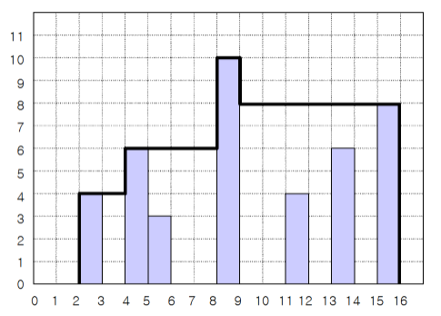
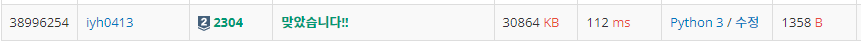

# [Baekjoon] 2304. 창고 다각형 [S2]

## 📚 문제

링크 : https://www.acmicpc.net/problem/2304

---

창고를 가장 높은 기둥에서 양쪽으로 내려가는 구조로 만들어야 한다.



입력받은 기둥의 위치와 높이로 최고 높이에 있는 기둥을 구하면서 index는 현재 위치이고 index에 대응되는 값은 높이를 가지는 리스트를 만든다. 또한 기둥이 존재하는 최소 최대 index값도 구한다.

리스트에서 가장 왼쪽 기둥부터 최고 높은 기둥까지 순차적으로 보면서 가장 높은 기둥의 값을 결과 값에 더해준다.

왼쪽부터 가장 높은 기둥을 만날 때까지 각 기둥에 높이의 최고값을 넣어준다.

오른쪽도 마찬가지로 시행한다.

## 📒 코드

```python
N = int(input())    # 기둥의 개수

min_x = 1001 # 기둥이 있는 위치 최소값
max_x = 0 # 기둥이 있는 위치 최대값
max_height = 0 # 제일 높은 기둥의 높이
max_height_x = 0 # 제일 높은 기둥이 있는 위치
height_lst = [0 for _ in range(0, 1001)]    # index는 위치, 값은 height
result = 0

for i in range(N):   
    x, height = map(int, input().split())  # 기둥의 위치와 높이를 변수에 넣어준다.
    if x > max_x:   max_x = x   # 기둥 위치의 최대 최소값을 찾는다.
    if x < min_x:   min_x = x
    if height > max_height:
        max_height = height # 기둥의 최고 높이
        max_height_x = x    # 최고 높을 때의 위치
    height_lst[x] = height  # 높이 값을 리스트에 담아준다.

max_height = 0  # 변수 재활용하기 위해 초기화, 현재까지 제일 높은 기둥
for i in range(min_x, max_height_x + 1):    # 왼쪽부터 가장 높은 기둥까지 현재 최대높이 업데이트
    if max_height < height_lst[i]:
        max_height = height_lst[i]
    result += max_height    # 현재 가장 최고 높이를 더해준다.

max_height = 0 # 변수 재활용하기 위해 초기화, 현재까지 제일 높은 기둥
for i in range(max_x, max_height_x, -1):    # 오른쪽부터 가장 높은 기둥 전까지 현재 최대높이 업데이트
    if max_height < height_lst[i]:
        max_height = height_lst[i]
    result += max_height    # 현재 가장 최고 높이를 더해준다.

print(result)
```

## 🔍 결과



처음에 정렬시켜서 해결하려고 해서 크게 돌아갔다.. 어차피 최소 최대 모든 인덱스의 넓이를 구해줘야하니 정렬할 필요가 없다. list의 인덱스와 대응되는 값을 기둥의 위치와 높이로 대응시켜 해결한다!