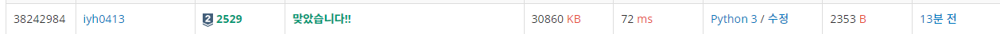

# [Baekjoon] 2529. 부등호[S2]

문제: https://www.acmicpc.net/problem/2529

---

입력으로 받는 부등호 갯수를 사이에 두고 숫자를 배열하는 문제이다. 내림차순, 오름차순으로 가장 큰 숫자와 가장 작은 숫자를 구하는 것인데 **오름차순의 제일 작은 수는 무조건 0~k까지의 수로 만들 수 있고 내림차순의 제일 큰 수는 무조건 9~9-k수로 만들 수 있다.** 오름차순 관련 함수 하나, 내림차순 관련 함수 하나 두 개를 만들었다.

계속 반복되므로 **재귀함수**를 사용한다. **순열**에서 재귀함수를 사용할 땐  for문에 넣어 반복시키는 걸 기억하자!! for문 안에 재귀함수를 넣으면 오름차순으로 만족시키는 모든 답이 출력되므로 가장 먼저나오는 답 이외에는 나오지 않도록 조건문으로 처리한다. 내가 푼 코드에서는 success 변수를 사용해서 처리했다. 함수 안에서 정의를 하면 함수를 돌며 바뀌니까 밖에 정의하고 **global** 키워드로 불러와서 사용한다.

---

코드:

```python
k = int(input())
lst_sign = input().split() # > < 를 나눠서 받는다.

lst = [-1 for _ in range(k+1)] # 출력 배열
success = False

def up_recur(cur):
    global success
    for i in range(0,k+1):  # index 0 부터 순서대로 넣어준다. 길이가 5면 0~4 숫자로 무조건 만들 수 있다.
        if cur == 0:    # 첫자리는 부등호 비교할 필요 없다. 중복된 수도 비교할 필요 X
            lst[cur] = i
            up_recur(cur+1)
        elif success:   # 성공한게 있으면 다른 거 출력안되게 막는다.
            return
        else:
            if i not in lst: # 앞에 나왔던 숫자에 중복되는지 확인한다.
                if (lst_sign[cur-1] == '<' and lst[cur-1] < i) or (lst_sign[cur-1] == '>' and lst[cur-1] > i):
                    lst[cur] = i
                    if cur == k:
                        success = True  # 가장 최근에 만들어진 하나만 출력하게 해주기 위해 사용
                        print(''.join(map(str,lst))) # lst를 str으로 바꿔 출력
                        break
                    up_recur(cur+1)
                    lst[cur] = -1   # 다음 자릿 수를 순차적으로 돌며 막히면 자릿 수를 다시 수정해준다.

def down_recur(cur):
    global success
    for i in range(9,8-k,-1):  # index 9 부터 순서대로 넣어준다.
        if cur == 0:    # 첫자리는 부등호 비교할 필요 없다. 중복된 수도 비교할 필요 X
            lst[cur] = i
            down_recur(cur+1)
        elif success:
            return
        else:
            if i not in lst: # 앞에 나왔던 숫자에 중복되는지 확인한다.
                if (lst_sign[cur-1] == '<' and lst[cur-1] < i) or (lst_sign[cur-1] == '>' and lst[cur-1] > i):
                    lst[cur] = i
                    if cur == k:
                        success = True  # 가장 최근에 만들어진 하나만 출력하게 해주기 위해 사용
                        print(''.join(map(str,lst))) # lst를 str으로 바꿔 출력
                        break
                    down_recur(cur+1)

                    lst[cur] = -1   # 다음 자릿 수를 순차적으로 돌며 막히면 자릿 수를 다시 수정해준다.

down_recur(0) # index 0의자리부터 순차적으로 출력 

lst = [-1 for _ in range(k+1)] # 다시 초기화
success = False # 초기화

up_recur(0) 
```

제출했는데 자꾸 틀리길래 무언가해서 보니까 출력값을 띄어서 출력하는게 아니라 붙여서 출력하는거였다.. 그래서 언팩연산자를 활용해 list를 풀어 제출했는데 map과 join함수를 사용해 string으로 바꾼 후 붙여서 출력했다.

그리고 돌려보니 정답~~😁

---

