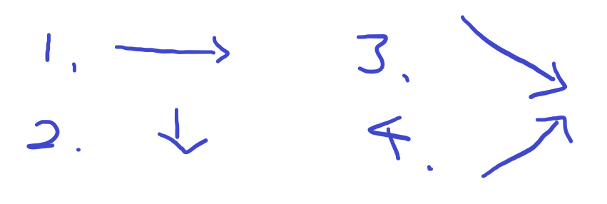
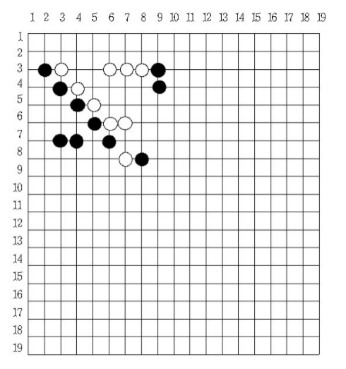

# [Baekjoon] 2615. 오목[S2]

## 📚 문제

https://www.acmicpc.net/problem/2615

---

오목이 가능한 가짓수를 4가지로 생각한다. 문제에서 오목이 만들어졌을 때 제일 왼쪽 방향의 좌표를 원하고 세로로 일직선이면 위쪽 방향이길 원하므로 오른쪽 방향, 아래쪽 방향, 왼쪽 위쪽에서 오른쪽 아래쪽 방향, 왼쪽 아래쪽에서 오른쪽 위쪽 방향으로 4가지로 나누어 해결해보았다.



문제에서 주어진 바둑판의 방향은 다음과 같다.



왼쪽, 위쪽 끝을 (0,0)으로 잡고 모든 좌표를 검색해 시작점으로 가능한지 확인한다. 5개를 만들 수 없는 좌표는 제외한다. 예를 들어 (1,16)이 시작점으로 5개를 만들 수 없으니 제외한다.

시작점에는 반드시 바둑돌이 있어야 하므로, 바둑돌이 없는 0이 있으면 지나간다. 또한 오른쪽으로 찾는다고 가정하면 시작점의 반대쪽으로 똑같은 돌이 있어도 그 땐 시작점이 아니니 지나간다. 이 때 시작점의 반대쪽으로 바둑돌을 둘 수 없어 이때 조건도 따로 지정해주어야 한다.

5개의 돌이 똑같으면 6개 이상이 안놓여지는지도 확인한다. 5개만 이루어졌을 때로 답을 찾아야 하니 바독판 바깥으로 나가게 되는 경우도 조건식으로 적어준다.

## 📒 코드

```python
input_lst = [0 for i in range(19)]
for i in range(19):
    input_lst[i] = list(map(int, input().split()))

def omok(lst):
    win = 0 # 0이면 승부x, 1이면 검은돌 승리, 2이면 흰돌 승리
    position = 0
    for i in range(19): # 이중 for 문으로 오목이 완성될 수 있는 시작점을 하나씩 선택
        for j in range(15): # 시작점에서 오른쪽으로 오목이 완성되는지 확인
            if lst[i][j] != 0:  # 바둑돌이 놓여 있을 때
                if j == 0 or lst[i][j] != lst[i][j-1]:  
                    # 바둑돌 왼쪽에 값이 없거나, 있을 때는 색이 다르면 시작점으로 선택한다.
                    for k in range(1,5): # 5개가 나란히 있는지 확인
                        if lst[i][j] != lst[i][j+k]:
                            break
                    else:
                        if j == 14 or lst[i][j] != lst[i][j+5]: # 오른쪽으로 더 놓을 자리가 없거나 오른쪽에 놓인 것이 다른 색인지 확인.
                            win = lst[i][j]
                            position = (i+1,j+1)

    for i in range(15): # 이중 for 문으로 오목이 완성될 수 있는 시작점을 하나씩 선택
        for j in range(19): # 시작점에서 아래쪽으로 오목이 완성되는지 확인
            if lst[i][j] != 0:  # 바둑돌이 놓여 있을 때
                if i == 0 or lst[i][j] != lst[i-1][j]:
                    # 바둑돌 위쪽에 값이 없거나, 있을 때는 색이 다르면 시작점으로 선택한다.
                    for k in range(1,5): # 5개가 나란히 있는지 확인
                        if lst[i][j] != lst[i+k][j]:
                            break
                    else:
                        if i == 14 or lst[i][j] != lst[i+5][j]: # 아래쪽으로 더 놓을 자리가 없거나 아래쪽에 놓인 것이 다른 색인지 확인.
                            win = lst[i][j]
                            position = (i+1,j+1)

    for i in range(15): # 이중 for 문으로 오목이 완성될 수 있는 시작점을 하나씩 선택
        for j in range(15):    # 시작점에서 오른아래쪽으로 오목이 완성되는지 확인
            if lst[i][j] != 0:  # 바둑돌이 놓여 있을 때              
                if i == 0 or j == 0 or lst[i][j] != lst[i-1][j-1]: 
                    # 바둑돌 왼쪽이나 위쪽에 값이 없거나, 있을 때는 색이 다르면 시작점으로 선택한다.
                    for k in range(1,5): # 5개가 나란히 있는지 확인
                        if lst[i][j] != lst[i+k][j+k]:
                            break
                    else:
                        if i == 14 or j == 14 or lst[i][j] != lst[i+5][j+5]: # 오른쪽, 아래쪽으로 더 놓을 자리가 없거나 오른아래쪽에 놓인 것이 다른 색인지 확인.
                            win = lst[i][j]
                            position = (i+1,j+1)

    for i in range(18,3,-1): # 이중 for 문으로 오목이 완성될 수 있는 시작점을 하나씩 선택
        for j in range(15): # 시작점에서 오른위쪽으로 오목이 완성되는지 확인
            if lst[i][j] != 0:  # 바둑돌이 놓여 있을 때
                 if i == 18 or j == 0 or lst[i][j] != lst[i+1][j-1]:
                    # 바둑돌 왼쪽이나 아래쪽에 값이 없거나, 있을 때는 색이 다르면 시작점으로 선택한다.
                    for k in range(1,5): # 5개가 나란히 있는지 확인
                        if lst[i][j] != lst[i-k][j+k]:
                            break
                    else:
                        if i == 4 or j == 14 or lst[i][j] != lst[i-5][j+5]: # 오른쪽, 위쪽으로 더 놓을 자리가 없거나 오른위쪽에 놓인 것이 다른 색인지 확인.
                            win = lst[i][j]
                            position = (i+1,j+1)
    if win == 0:    # 승부가 나지 않으면 0만 출력
        print(win)
        return
    print(win)  # 승부가 났으니 승리한 돌을 출력한 후 위치를 출력한다.
    print(*position)

omok(input_lst)
```

## 🔍 결과


처음에 너무 어렵게 접근해서 몇 시간을 헤매다가 방법을 바꿔 해결했다..😅