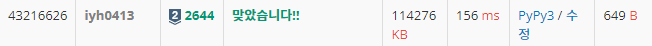

# [Baekjoon] 2644. 촌수계산 [S2]

## 📚 문제 : [촌수계산](https://www.acmicpc.net/problem/2644)

## 📖 풀이

촌수 계산은 두 정점 사이의 최단 거리를 구하면 된다.

따라서 BFS로 해결한다.

주어진 정점의 연결을 그래프로 연결하는데 양방향으로 연결한다.

주어진 두 사람의 번호 중 어떤 걸로 큐에 담아 시작하든 상관없다. 하나로 시작하면 나머지 하나에 도착하게 하면 된다.

BFS의 depth를 구하는 걸 활용해서 해결한다.

## 📒 코드

```python
from collections import deque


n = int(input())
a, b = map(int, input().split())
m = int(input())
graph = [[] for _ in range(n + 1)]
visited = [0 for _ in range(n + 1)]

for i in range(m):  # 양방향으로 연결
    x, y = map(int ,input().split())
    graph[x].append(y)
    graph[y].append(x)

que = deque()
que.append(a)
visited[a] = 1

d = 0
while que:      # BFS 탐색
    sz = len(que)
    for _ in range(sz):
        v = que.popleft()
        if v == b:
            print(d)
            exit()
        for nxt in graph[v]:
            if visited[nxt]:
                continue
            visited[nxt] = 1
            que.append(nxt)
    d += 1

print(-1)
```

## 🔍 결과

