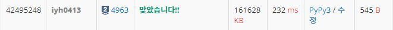

# [Baekjoon] 4963. 섬의 개수 [S2]

## 📚 문제

https://www.acmicpc.net/problem/4963

---

## 📖 풀이

연결 요소를 구하는 문제이다.

대각선으로도 연결할 수 있으니 8방향을 탐색해야한다.

BFS로도 할 수 있는데, DFS로 연결 요소의 개수를 찾는다.

## 📒 코드

```python
def dfs(x, y):      # 연결 요소 구하기
    arr[x][y] = 0   # 연결 요소는 다 0으로 바꾼다.

    for i in range(8):
        nx = x + dx[i]
        ny = y + dy[i]
        if 0 <= nx < h and 0 <= ny < w and arr[nx][ny]:
            dfs(nx, ny)


dx = [0, 1, 1, 1, 0, -1, -1, -1]    # 대각선 방향도 구한다.
dy = [1, 1, 0, -1, -1, -1, 0, 1]
while True:
    w, h = map(int, input().split())
    if w == 0:      # 0이면 종료
        break
    arr = [list(map(int, input().split())) for _ in range(h)]

    cnt = 0
    for i in range(h):
        for j in range(w):
            if arr[i][j]:
                dfs(i, j)
                cnt += 1        # 연결 요소의 개수 + 1
    print(cnt)
```

## 🔍 결과

