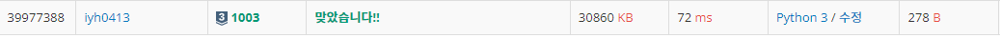

# [Baekjoon] 1003. 피보나치 함수 [S3]

## 📚 문제

https://www.acmicpc.net/problem/1003

---

**DP문제**이다. 점화식을 생각해본다.

0의 개수와 1의 개수가 각각 fibo(i) = fibo(i-1) + fibo(i-2) 이다.

위의 **점화식**을 이용하면 초기조건이 2개 필요하다.

따라서 **메모이제이션**을 위한 memo 리스트를 만들고 0과 1일 때 값을 담아준다.

0일 때 [1, 0], 1일 때 [0, 1]을 담아준다.

그리고 N의 최댓값이 40이므로 메모이제이션의 길이가 41이 되도록 만들어준다.

현재 memo에 적혀있는 구간을 알기 위해 cnt 변수를 선언하고 cnt가 입력보다 작으면 입력된 숫자까지 memo를 추가시켜준다.

이미 memo에 적혀있는 숫자는 바로 출력한다.

## 📒 코드

```python
memo = [[0, 0] for _ in range(41)]
memo[0] = [1, 0]
memo[1] = [0, 1]
cnt = 1
for i in range(int(input())):
    n = int(input())
    while cnt < n:
        for i in range(2):
            memo[cnt + 1][i] = memo[cnt][i] + memo[cnt - 1][i]
        cnt += 1
    
    print(*memo[n])
```

## 🔍 결과

