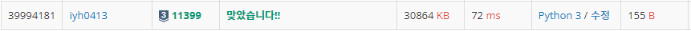

# [Baekjoon] 11399. ATM [S3]

## 📚 문제

https://www.acmicpc.net/problem/11399

---

최소의 시간을 만드려면 오름차순으로 정렬시켜야 한다.

정렬시킨 배열을 **누적합**을 활용해 더해준다.

누적합한 결과를 중간에 계속 합을 또 해주기 위해 time 변수를 선언한다.

누적합하면서 합한 결과를 바로 `time`에 더해준다.

## 📒 코드

```python
n = int(input())
arr = list(map(int, input().split()))
arr.sort()      # 정렬
time = arr[0]
for i in range(1, n):  
    arr[i] += arr[i-1]  # 누적합
    time += arr[i]      # 누적합 시키면서 누적합의 결과를 time에 더한다.
print(time)
```

## 🔍 결과

