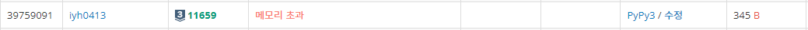
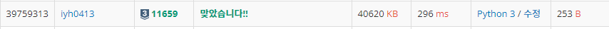

# [Baekjoon] 11659. 구간 합 구하기 4 [S3]

## 📚 문제

https://www.acmicpc.net/problem/11659

---

구간 합 구하는 문제이다. 수의 개수가 100000개이며, 구해야 하는 구간 합도 100000이니 이중 for문으로 구하면 시간초과가 발생할 수 밖에 없다.

그래서 2차원 배열을 만들어 구할 값을 **메모이제이션**하는 방법으로 구해본다.

## 📒 코드

```python
import sys
input = sys.stdin.readline

n, m = map(int, input().split())
arr = [0] + list(map(int, input().split()))

memo = [[arr[i]] for i in range(n + 1)]

for _ in range(m):
    i, j = map(int, input().split())
    while len(memo[i]) <= j - i:
        memo[i].append(memo[i][len(memo[i]) - 1] + arr[len(memo[i]) + i])

    print(memo[i][j-i])

```

## 🔍 결과 - 메모리 초과



2차원 배열을 만들어 저장하기에는 메모리 초과가 발생한다.

좀 더 심플한 방법을 생각해본다.

---

구간합을 **누적합**으로 구하면 훨씬 편하게 구할 수 있다.

앞에 zero 패딩하나를 넣어 인덱스의 순서를 맞춰준다. 그리고 누적합을 구한 후  [1, 3] 구간은 구간합의 3번째 인덱스와 0번째 인덱스의 차이로 계산한다.

따라서 [a, b] 구간은 구간합의 b번째 인덱스 값에서 a-1번째 인덱스 값을 빼주면 된다.

## 📒 코드

```python
import sys
input = sys.stdin.readline

n, m = map(int, input().split())
arr = [0] + list(map(int, input().split()))

for i in range(1, n + 1):
    arr[i] += arr[i - 1]

for i in range(m):
    a, b = map(int, input().split())
    print(arr[b] - arr[a-1])
```

## 🔍 결과



구간합 구하는 문제는 누적합을 항상 생각하자~!
