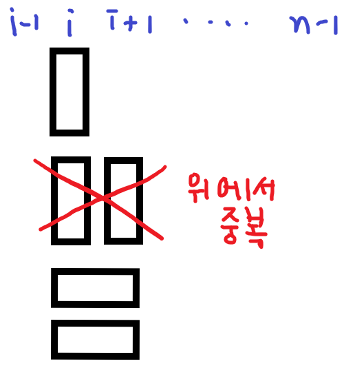
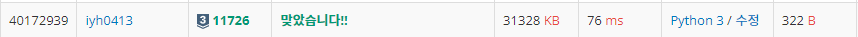

# [Baekjoon] 2xn 타일링[S3]

## 📚 문제

https://www.acmicpc.net/problem/11726

---

백트래킹 + DP의 업다운 방식으로 해결해보았다.

n을 구하기 위해 0번째 인덱스부터 순차적으로 구해본다.

아래 그림을 확인해보자.



현재 i번째 이후에 오는 모든 경우의 수를 구한다. 그걸 total[i]로 정의하자.

위 그림을 점화식으로 작성하면 다음과 같다.

> total[i] = total[i+1] + total[i+2]

위에서 두번째 그림같이 놓이는 경우는 첫번째 그림처럼 놓았을 때 뒤에 놓는 경우와 겹치는 경우가 발생한다. 따라서 위 점화식으로 작성하여 해결하면된다.

재귀함수를 사용하면 **RecursionError**가 발생한다.

따라서

```python
import sys
sys.setrecursionlimit(10**5)
```

를 사용하여 재귀깊이 제한을 없애준다.

그리고 위 점화식만 사용하면 완전탐색을 하게 되므로 중간에 봤던 값은 또 보지 않게하기 위해서 메모이제이션을 사용해 중간 값들을 저장한다.

## 📒 코드

```python
import sys
sys.setrecursionlimit(10**5)

def recur(cur):
    if cur == n:
        return 1
    if cur > n:
        return 0
    if dp[cur] != -1:
        return dp[cur]
    
    dp[cur] = recur(cur + 1) + recur(cur + 2)
    dp[cur] %= 10007
    return dp[cur]


n = int(input())
dp = [-1 for i in range(n)]
print(recur(0))
```

## 🔍 결과

