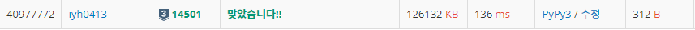

# [Baekjoon] 14501. 퇴사 [S3]

## 📚 문제

https://www.acmicpc.net/problem/14501

---

## 📖 풀이

재귀를 활용한 DFS로 해결하는데 조합을 활용한다.

상담을 고르는 것과 고르지 않는 것!

날짜만큼 진행시켜주니 백트래킹이라 할 수 있다.

재귀 호출할 때 상담의 날짜를 담아 호출하고, 날짜를 넘어가면 종료시킨다.

끝까지 갔을 때 최대 수익을 갱신한다.

하루에 상담일정이 하나씩 있으니 고르는 거와 안 고르는 걸로 조합으로 재귀 호출한다.

일정이 n에 도착하면 최댓값을 갱신하고 n을 넘어가면 상담 일정이 초과하는 것이니 버린다.

## 📒 코드

```python
def recur(day, p):
    global result
    if day > n:
        return
    if day == n:
        result = max(result, p)
        return
    recur(day + 1, p)
    recur(day + arr[day][0], p + arr[day][1])

n = int(input())
arr = [list(map(int, input().split())) for _ in range(n)]
result = 0
recur(0, 0)
print(result)
```

## 🔍 결과

