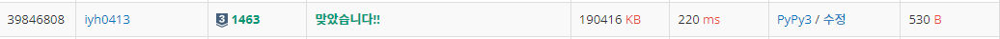
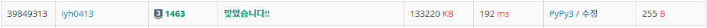

# [Baekjoon] 1463. 1로 만들기 [S3]

## 📚 문제

https://www.acmicpc.net/problem/1463

---

사용할 수 있는 연산은 3가지 

>1. X가 3으로 나누어 떨어지면, 3으로 나눈다.
>2. X가 2로 나누어 떨어지면, 2로 나눈다.
>3. 1을 뺀다.

**BFS 탐색**을 활용한다. 1을 큐에 넣는다. 큐에 있는 i를 꺼내면 i+1, ix2, ix3에 숫자가 있는지 확인 후 arr[i] 값에 1을 더한 값을 넣어주고 큐에 다시 담는 과정을 반복한다.

7을 찾는 연산을 해본다. 배열을 7까지 선언하고 0으로 초기화한다. queue에 값이 없거나 우리가 구할 index 7에 0이 아닌 값이 들어오면 종료한다.

먼저 1을 큐에 넣는다.

>queue = 1
>
>| 1    | 2    | 3    | 4    | 5    | 6    | 7    |
>| ---- | ---- | ---- | ---- | ---- | ---- | ---- |
>| 0    | 0    | 0    | 0    | 0    | 0    | 0    |

1을 큐에서 꺼낸다. `1 + 1 = 2`, `1 x 3 = 3`에 숫자가 없으니 1에있던 숫자에 1을 더한 1을 2, 3에 넣어주고 1과 2를 큐에 담는다. `1 x 2 = 2`는 2가 0보다 크니 확인하지 않는다.

>queue = 2, 3
>
>| 1    | 2    | 3    | 4    | 5    | 6    | 7    |
>| ---- | ---- | ---- | ---- | ---- | ---- | ---- |
>| 0    | 1    | 1    | 2    | 0    | 2    | 0    |

2를 큐에서 꺼낸다. `2 x 2 = 4`, `2 x 2 = 6`에 숫자가 없으니 각각 2에 있는 숫자보다 1큰 2를 담아주고, 4와 6을 큐에 담는다. 

>queue = 3, 4, 6
>
>| 1    | 2    | 3    | 4    | 5    | 6    | 7    |
>| ---- | ---- | ---- | ---- | ---- | ---- | ---- |
>| 0    | 1    | 1    | 2    | 0    | 2    | 0    |

위 과정을 반복하며 7에 숫자가 들어가면 출력한다.

## 📒 BFS 코드

```python
from collections import deque


n = int(input())
arr = [0] * (n + 1)
queue = deque()
queue.append(1)

while queue and arr[n] == 0:
    v = queue.popleft()
    if v + 1 < len(arr) and arr[v+1] == 0:
        arr[v+1] = arr[v] + 1
        queue.append(v + 1)
    if v * 2 < len(arr) and arr[v*2] == 0:
        arr[v*2] = arr[v] + 1
        queue.append(v * 2)
    if v * 3 < len(arr) and arr[v*3] == 0:
        arr[v*3] = arr[v] + 1
        queue.append(v * 3)
print(arr[n])
```

## 🔍 결과


DP방법으로도 풀어본다.

---

메모이제이션을 활용한다. memo 리스트를 만들고 2차원 리스트로 선언한다.

memo 리스트의 인덱스는 횟수로 적어 횟수가 0, 1, 2부터 순차적으로 채운다. 첫번째 인덱스에 담긴 리스트에는 횟수가 1일 때의 숫자들, 두번째 인덱스에 담긴 리스트에는 횟수가 2일 때의 숫자들을 담는다.

나온 숫자들을 또 담지 않기 위해서 visited를 0으로 초기화에 나온 숫자들을 1로 담아준다.

## 📒 DP 코드 1

```python
n = int(input())
memo = [[1]]            # 인덱스에는 횟수의 최솟값에 맞는 숫자들을 채운다. 0부터 순차적으로 채워나간다.
visited = [0] * (n + 1) 
visited[1] = 1          # 1을 담아준다.

while visited[n] == 0:  # n이 나오면 종료
    arr = []
    for num in memo[-1]:    # 현재 memo의 젤 오른쪽에 담겨있는 숫자들을 사용한다.
        if num + 1 < n + 1 and visited[num + 1] == 0:   # 1을 더한 값이 나왔는지 확인
            visited[num + 1] = 1
            arr.append(num + 1)
        if num * 2 < n + 1 and visited[num * 2] == 0:   # 2를 곱한 값이 나왔는지 확인
            visited[num * 2] = 1
            arr.append(num * 2)
        if num * 3 < n + 1 and visited[num * 3] == 0:   # 3을 곱한 값이 나왔는지 확인
            visited[num * 3] = 1
            arr.append(num * 3)
    memo.append(arr)        # 나오지 않았던 숫자들을 다음 인덱스에 배열로 넣어준다.

print(len(memo) - 1)    # 원하는 숫자가 나왔을 때 리스트의 맨 끝 인덱스 값을 출력
```

## 🔍 결과



---

DP를 사용하는 데 이번에는 1에는 0을 담고 2부터 1씩 더하며 순차적으로 값을 넣어준다. i의 값을 찾아줄 때 i-1, i//2, i//3 중 최소값에 1을 더한다. i//2와 i//3은 2와 3으로 나누어떨어질 때만 사용한다.

코드가 젤 간단하게 나온다.

## 📒 DP 코드 2

```python
n = int(input())
arr = [0] * (n + 1)

for i in range(2, n + 1):
    arr2 = []
    if i % 2 == 0:
        arr2.append(arr[i // 2])
    if i % 3 == 0:
        arr2.append(arr[i // 3])
    arr2.append(arr[i - 1])
    arr[i] = min(arr2) + 1

print(arr[n])
```

## 🔍 결과



시간이 젤 빠르지만 다 비슷비슷하다.

메모이제이션을 활용하여 DP로 구하는 방법, 점화식을 활용해 DP로 구하는 방법, BFS로 구하는 방법으로 다양하게 풀어보았다.
