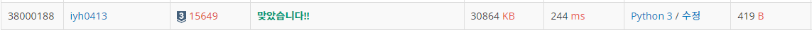

# [Baekjoon] 15649. N과 M(1)[S3]

## 📚 문제

https://www.acmicpc.net/problem/15649

---

**재귀함수**로 푸는 문제이다.

함수를 돌 때마다 순열의 순서대로 확인하고 마지막 길이까지 넣어주면 출력해준다.

**for문 안에 재귀함수를 넣는 것이 포인트**이다.

반복된 숫자를 제거하기 위해 visited list에 숫자가 사용됐는지 확인한다.

사용되면 True, 아직 사용안했으면 False로 하여 확인 후 순서대로 값을 넣어 출력한다.

## 📒 코드

```python
n,m = map(int, input().split())

arr = [0 for i in range(m)]
visited = [False for i in range(n)] # 중복된 순열이 나오지 않게 사용된 숫자인지 확인!

def recur(cur): # 순열의 첫자리부터 채워준다.
    if cur == m:
        print(*arr) # 순열이 완성되면 프린트한다.
        return
    else:
        for i in range(n):  # 자리마다 모든 경우의 수를 넣어주기 위해 for문에 재귀함수를 넣는다.
            if visited[i] == True:
                continue
            else:
                arr[cur] = i+1
                visited[i] = True
                recur(cur+1)
                visited[i] = False

recur(0)
```

## 🔍 결과



