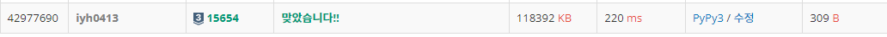

# [Baekjoon] 15654. N과 M (5) [S3]

## 📚 문제 : [N과 M (5)](https://www.acmicpc.net/problem/15654)

---

## 📖 풀이

N개의 입력된 자연수 중 M개를 골라 사전 순으로 출력시키는 문제이다.

중복 없는 순열로 골라, M개가 됐을 때 출력한다.

주어진 자연수의 개수는 8이하인데 자연수의 값은 10000보다 작거나 같은 자연수이다. 따라서 visited를 카운팅 배열로 활용하지 않고 값을 담아주고, 뺄 때 `pop()`을 이용해서 뺀다.

출력할 때에는 M개가 됐을 때, visited를 언패킹 연산자를 활용해 출력한다.

## 📒 코드

```python
def recur(cur):
    if cur == m:
        print(*visited)
    for i in range(n):
        if arr[i] in visited:
            continue
        visited.append(arr[i])
        recur(cur + 1)
        visited.pop()


n, m = map(int, input().split())
arr = sorted(list(map(int, input().split())))
visited = []
recur(0)
```

## 🔍 결과

