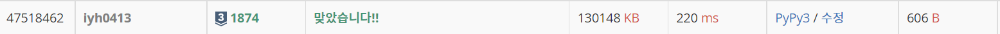

# [Baekjoon] 1874. 스택 수열 [S3]

## 📚 문제 : [스택 수열](https://www.acmicpc.net/problem/1874)

## 📖 풀이

스택 문제이다. 조건으로 분기처리할 게 생각보다 많아 까다롭다.

1부터 n까지 꺼내는 방식보다, 만들어야 하는 숫자를 순회하며 답을 찾아준다.

1. 꺼내야 하는 수가 index 값과 같으면 넣고 빼면 된다.

2. 꺼내야 하는 수가 index 값보다 크면 같기 전까지 stack에 넣고 같을 때는 넣고 뺀다.

3. 꺼내야 하는 수가 index 값보다 작으면 stack에서 꺼낸 수랑 같은 지 확인하고, 같지 않으면 NO를 출력한다.

위 과정을 반복하고 에러가 나지 않으면 결과 값을 출력한다.

결과 값에는 넣고 빼는 값을 리스트에 계속 담아주고 그걸 출력하면 된다.

## 📒 코드

```python
import sys
input = sys.stdin.readline

n = int(input())
arr = [int(input()) for _ in range(n)]
stack = []

index = 1
result = []
for num in arr:
    if num == index:
        result.append('+')
        result.append('-')
        index += 1
    elif num > index:
        for i in range(index, num):
            stack.append(i)
            result.append('+')
        result.append('+')
        result.append('-')
        index = num + 1
    else:
        if stack.pop() == num:
            result.append('-')
        else:
            print('NO')
            break
else:
    for x in result:
        print(x)

```

## 🔍 결과

