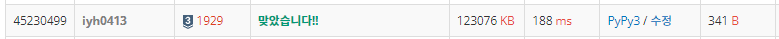

# [Baekjoon] 1929. 소수 구하기 [S3]

## 📚 문제 : [소수 구하기](https://www.acmicpc.net/problem/1929)

## 📖 풀이

소수 출력하는 문제이다.

**에라토스테네스의 체**로 구한다.

2부터 확인하면서 소수의 배수들을 다 visited 배열에 1로 표시한다. 이미 visited 배열에 표시된 수들은 확인하지 않고 나머지들은 다 소수이므로 n까지 반복한다.

1도 visited 배열에 1로 표시해 합성수임을 표시하고 나머지 소수들을 출력해야 한다.

## 📒 코드

```python
m, n = map(int, input().split())
visited = [0 for _ in range(n + 1)]     # 소수는 0이 유지된다.
visited[1] = 1      # 1은 소수가 아니다.

for i in range(2, n + 1):
    if visited[i]:
        continue
    for j in range(2 * i, n + 1, i):
        visited[j] = 1

for i in range(m, n + 1):
    if not visited[i]:
        print(i)
```

## 🔍 결과

