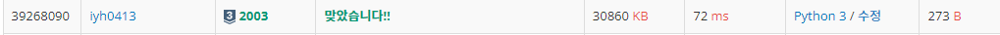

# [Baekjoon] 2003. 수들의 합2 [S3]

## 📚 문제

https://www.acmicpc.net/problem/2003

---

**투 포인터 문제**이다. 투 포인터 s, e가 함께 출발하는 문제를 풀어보았다.

>s와 e를 0 인덱스에서 출발해 s부터 e까지의 수열의 합을 비교해가며 e가 배열을 넘는 경우 반복문을 종료한다.
>
>합이 M이랑 같을 때의 수를 구해야 하니 같으면 cnt를 1 증가시키고, e를 한 칸 움직인다.(s,e 중 아무거나 움직여도 된다, 둘 다 움직여도 된다!)
>
>합이 M보다 작으면 e를 한 칸 움직여 합을 키우고, M보다 크면 s를 움직여 합을 줄인다.
>
>s가 e를 추월하는 순간 합은 0이 되니 e가 넘어와 정상적으로 작동한다. 따라서 예외처리 안해줘도 상관없다.

위를 코드로 구현하면 e를 한 칸 움직이고 합을 구하는 경우 맨 끝 인덱스에서 **인덱스 오류**가 발생한다.

따라서 주어진 배열을 옆에 [0]을 포함시킨 **패딩(padding)**을 활용해 해결한다.

## 📒 코드

```python
N, M = map(int, input().split())
# e가 1 더해지고 호출하니 배열을 넘칠 수 있다. 그래서 padding을 활용한다.
arr = list(map(int, input().split())) + [0] 
s = e = cnt = 0
sum = arr[0]
while e < N:    # e가 넘치면 종료
    if sum <= M:    # M보다 작거나 같을 때 e 증가, 같을 때는 s를 증가시키든 상관없다.(둘 다 증가시켜도 된다.)
        if sum == M:
            cnt += 1
        e += 1
        sum += arr[e]   # e가 배열을 넘어가면 한번 참조하긴 해야해서 위에 패딩을 넣어주었다.
    else:
        sum -= arr[s]
        s += 1
print(cnt)
```

## 🔍 결과



