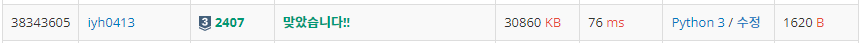

# [Baekjoon] 2407. 조합[S3]

## 📚 문제

https://www.acmicpc.net/problem/2407

---

조합이란 **서로 다른 n개중에 r개를 선택하는 경우의 수** : <sub>100</sub>C<sub>5</sub> = `100*99*98*97*96`/`5*4*3*2*1`

<sub>n</sub>C<sub>m</sub>의 분자를 그대로 곱해서 계산하면 메모리 초과가 예상된다.

따라서 최대한 메모리를 아껴서 해결할 수 있는 방법을 생각해본다.

---

1. n-m이 m보다 작은 경우 <sub>n</sub>C<sub>m</sub> = <sub>n</sub>C<sub>n-m</sub>로 바꾼다. 

   >ex). <sub>4</sub>C<sub>3</sub> => <sub>4</sub>C<sub>1</sub>로 바꾼다.
   >
   >```python
   >if n-m < m: # nCm에서 m이 n의 절반보다 클 경우 n-m으로 바꾼다.
   >    m = n-m
   >```

2. 분자, 분모를 리스트에 하나씩 담는다.

   >```python
   >up_lst = [n-i for i in range(m)]    # 분자를 리스트에 하나씩 담는다.
   >down_lst = [i for i in range(1, m+1)] # 분모를 리스트에 담는다.
   >```

3. m이하의 소수를 재귀함수로 찾는다. 그리고 list에 담는다.

   >```python
   >sosu_lst = []   # m이하의 소수를 찾아 담는다.
   >
   >def sosu(num): # num이하의 소수를 찾는 함수
   >    if num > m: # 숫자가 m보다 큰 값이 나오면 안 찾는다.
   >        return
   >    for i in range(2, num):
   >        if num % i == 0:
   >            break
   >    else: sosu_lst.append(num)
   >    return sosu(num+1)
   >
   >sosu(2)
   >```

4. 조합 중 분모를 소수의 곱 형태로 바꾼다. 

   >ex). 5x4x3x2x1 = 2<sup>3</sup>x3x5
   >
   >분모를 소수의 곱으로 나타내기 위해 m+1 길이의 list를 만들고 각 인덱스를 숫자로 연결시켜 소수의 갯수(지수 값)만큼 넣어준다. 0과 1은 필요없으니 안 넣는다.  
   >
   >재귀함수를 이용한다. 2부터 m까지의 수 중 소수로 나누어 1이 될 때까지 나눈다. 소수로 나누어지면 그 때 인덱스 값을 올려 소수의 갯수를 넣어준다.
   >
   >ex) `4*3*2*1` => lst = [0,0,3,1,0] 	소수인 2와 3에 지수 값을 넣어준다.
   >
   >```python
   >sosu_cnt_lst = [0 for _ in range(m+1)]    # 인덱스 맞춰 0~m까지의 소수 개수 초기화
   >
   >def sosu_cnt(num):  # 소수의 개수를 찾아주는 함수
   >    if num > m: # 숫자가 m보다 큰 값이 나오면 안 찾는다.
   >        return
   >    new_num = num
   >    for sosu in sosu_lst:
   >        if new_num == 1:
   >            break    
   >        while new_num % sosu == 0:  # 위에서 구한 소수로 나누어 개수를 찾는다.
   >            new_num = new_num//sosu
   >            sosu_cnt_lst[sosu] += 1
   >    return sosu_cnt(num+1)
   >
   >sosu_cnt(2)
   >```

5. 분자를 분모로 나누어준다.

   >소수의 곱으로 이루어진 분모 리스트 중 소수가 작은 수부터 하나씩 분자를 나누어준다.분자의 숫자들을 담은 리스트도 하나씩 순회해가며 분모에서 픽한 소수의 개수가 0이 될 때까지 다 나누어준다.
   >
   >다 나누고 남은 분자의 숫자들을 곱해 답을 구한다.
   >
   >```python
   >result = 1
   >
   >for i in range(2, m+1): # 분모의 소수를 순서대로 가져와서 분자와 나누어 준다.
   >    if sosu_cnt_lst[i] != 0:   # 소수이고 나눌 수 있는 횟수가 있으면 반복문으로 들어온다.
   >        for j in range(len(up_lst)):
   >            while (sosu_cnt_lst[i] != 0) and (up_lst[j] % i == 0):  # 나누어지는지, 나눌 수 있는 수가 있는지 확인
   >                up_lst[j] = up_lst[j] // i
   >                sosu_cnt_lst[i] -= 1
   >
   >for num in up_lst:  # 다 나눈 수를 곱한다.
   >    result *= num
   >
   >print(result)
   >```

## 📒 최종 코드

```python
n , m = map(int, input().split())   # nCm의 입력 n과 m
if n-m < m: # nCm에서 m이 n의 절반보다 클 경우 n-m으로 바꾼다.
    m = n-m

up_lst = [n-i for i in range(m)]    # 분자를 리스트에 하나씩 담는다.
down_lst = [i for i in range(1, m+1)] # 분모를 리스트에 담는다.
sosu_lst = []   # m이하의 소수를 찾아 담는다.
sosu_cnt_lst = [0 for _ in range(m+1)]    # 인덱스 맞춰 0~m까지의 소수 개수 초기화
result = 1

def sosu(num): # num이하의 소수를 찾는 함수
    if num > m: # 숫자가 m보다 큰 값이 나오면 안 찾는다.
        return
    for i in range(2, num):
        if num % i == 0:
            break
    else: sosu_lst.append(num)
    return sosu(num+1)

def sosu_cnt(num):  # 소수의 개수를 찾아주는 함수
    if num > m: # 숫자가 m보다 큰 값이 나오면 안 찾는다.
        return
    new_num = num
    for sosu in sosu_lst:
        if new_num == 1:
            break    
        while new_num % sosu == 0:  # 위에서 구한 소수로 나누어 개수를 찾는다.
            new_num = new_num//sosu
            sosu_cnt_lst[sosu] += 1
    return sosu_cnt(num+1)

sosu(2)
sosu_cnt(2)

for i in range(2, m+1): # 분모의 소수를 순서대로 가져와서 분자와 나누어 준다.
    if sosu_cnt_lst[i] != 0:   # 소수이고 나눌 수 있는 횟수가 있으면 반복문으로 들어온다.
        for j in range(len(up_lst)):
            while (sosu_cnt_lst[i] != 0) and (up_lst[j] % i == 0):  # 나누어지는지, 나눌 수 있는 수가 있는지 확인
                up_lst[j] = up_lst[j] // i
                sosu_cnt_lst[i] -= 1

for num in up_lst:  # 다 나눈 수를 곱한다.
    result *= num

print(result)
```

## 🔍 결과



메모리 초과를 걱정해서 어렵게 접근해 해결했지만 파이썬은 오버플로우도 없고 그냥 분자를 다 곱해서 나누어도 메모리 초과가 일어나지 않는다고 한다... 괜히 어렵게 돌아가서 해결한 느낌..
