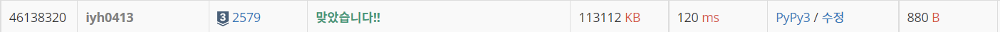

# [Baekjoon] 계단 오르기 [S3]

## 📚 문제 : [계단 오르기](https://www.acmicpc.net/problem/2579)

## 📖 풀이

- 계단 오르는 규칙
> 계단은 한 번에 한 계단씩 또는 두 계단씩 오를 수 있다. 즉, 한 계단을 밟으면서 이어서 다음 계단이나, 다음 다음 계단으로 오를 수 있다.
> 
>연속된 세 개의 계단을 모두 밟아서는 안 된다. 단, 시작점은 계단에 포함되지 않는다.
>
>마지막 도착 계단은 반드시 밟아야 한다.

현재 계단을 밟을 때의 최댓값을 적어나가는 **DP**로 해결한다.

세 계단을 연속해서 밟을 수 없으니 DP 값에 상태 2가지를 표현해서 넣어줘야 한다.

- 연속해서 계단을 밟지 않은 경우
  - 2칸 이전 계단의 점수 중 큰 값에 현재 계단의 점수를 더한다.
- 연속해서 계단을 밟은 경우
  - 1칸 이전 계단 중 연속해서 계단을 밟지 않은 경우의 점수에 현재 점수를 더한다.

DP를 탑다운으로 해결한다.
- n - 1 계단부터 출발하여 위 점화식을 사용해서 첫번째 계단부터 DP값을 채워나간다.
- 0보다 작은 인덱스 값이 나오면 계단의 범위를 넘어서니 0으로 처리하면 된다.

## 📒 코드
```python
def recur(cur, prv):    # 현재 계단과 이전 계단 밟았는지 여부
    if cur < 0:         # 계단의 범위를 넘어서는 경우
        return 0

    if dp[cur][prv]:    # 값이 존재하는 경우
        return dp[cur][prv]
    
    if prv == True:     # 이전 계단을 밟은 경우
        dp[cur][prv] = recur(cur - 1, False) + arr[cur]
    else:               # 이전 계단을 밟지 않은 경우
        dp[cur][prv] = max(recur(cur - 2, True), recur(cur - 2, False)) + arr[cur]
    return dp[cur][prv]

n = int(input())        # 계단의 개수
arr = [0 for _ in range(n)]         # 계단의 점수
for i in range(n):
    arr[i] = int(input())
dp = [[0, 0] for _ in range(n)]     # 연속해서 계단을 밟지않은 경우의 점수, 연속해서 밟은 경우의 점수 두 가지 상태 표시
print(max(recur(n - 1, False), recur(n - 1, True)))
```

## 🔍 결과


