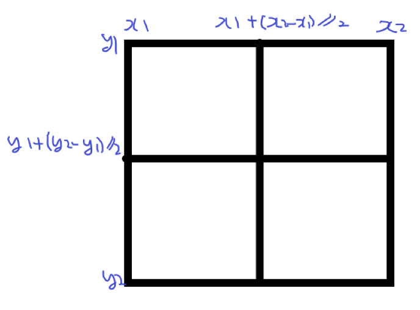
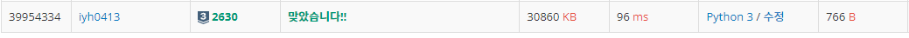

# [Baekjoon] 2630. 색종이 만들기 [S3]

## 📚 문제

https://www.acmicpc.net/problem/2630

---

분할 정복문제이다.

재귀함수를 활용해 색종이의 색이 다 같으면 탐색을 종료하고 다르면 4구간으로 나눠가며 탐색한다.

색종이의 색이 같은지 판단하는 코드를 함수로 따로 만들어서 사용한다.

색종이의 색이 다 같은지 확인하고 같을 때는 1인지 0인지 판단하여 cnt를 증가시켜준다.

다르면 네 구간으로 나누어 다시 함수를 호출해 탐색한다.

구간의 x,y좌표를 다음과 같이 나눌 수 있다. 



각 구간별로 생각해보면 이진탐색이다.

2차원이니 네 구간으로 나누어지며 탐색한다.

## 📒 코드

```python
def is_color(y1, y2, x1, x2):   # 색이 다 같은지 확인
    color = arr[y1][x1]
    for i in range(y1, y2):
        for j in range(x1, x2):
            if arr[i][j] != color:  # 다르면 False
                return False
    return True                     # 같으면 True


def b_search(y1, y2, x1, x2):   # 색종이 이진 탐색
    global ones, zeros
    if is_color(y1, y2, x1, x2):    # 색이 같으면 무슨 색인지 찾아서 cnt를 증가
        if arr[y1][x1]:       # 1이 있으니 ones 증가
            ones += 1
        else:                 # 0이 있으니 zeros 증가
            zeros += 1
        return                # 구간의 색이 다 같은 색종이는 stop
    else:                     # 색종이의 색이 다르면 4 구간으로 분할
        b_search(y1, y1 + (y2-y1)//2, x1, x1 + (x2-x1)//2)
        b_search(y1, y1 + (y2-y1)//2, x1 + (x2-x1)//2, x2)
        b_search(y1 + (y2-y1)//2, y2, x1, x1 + (x2-x1)//2)
        b_search(y1 + (y2-y1)//2, y2, x1 + (x2-x1)//2, x2)

N = int(input())
arr = [list(map(int, input().split())) for _ in range(N)]
zeros = 0
ones = 0
b_search(0, N, 0, N)
print(zeros)
print(ones)
```

## 🔍 결과

