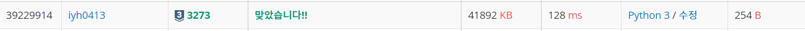

# [Baekjoon] 3273. 두 수의 합 [S3]

## 📚 문제

https://www.acmicpc.net/problem/3273

---

**투 포인터** 문제이다.

주어진 입력을 **sort** 메서드로 정리시킨 후 양 쪽의 포인터를 이용해 해결한다.

X보다 현재 두 수의 합이 작으면 s를 오른쪽으로 이동시키고, 같을 때의 수를 구해야하니 같으면 cnt를 1 증가시키고 e나 s를 아무거나 이동시킨다. 그리고 두 수의 합이 더 크면 e를 왼쪽으로 이동시킨다.

## 📒 코드

```python
N = int(input())
arr = list(map(int, input().split()))
X = int(input())
arr.sort()
s = 0
e = N - 1
cnt = 0

while s < e:
    if arr[s] + arr[e] >= X:
        if arr[s] + arr[e] == X:
            cnt += 1
        e -= 1
    else:
        s += 1
print(cnt)
```

## 🔍 결과



