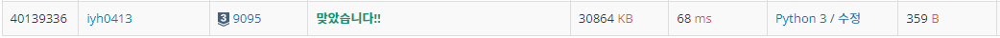

# [Baekjoon] 9095. 1, 2, 3 더하기 [S3]

## 📚 문제

https://www.acmicpc.net/problem/9095

---

백트래킹을 활용한 DP문제이다. 

n이 입력으로 들어오면 1, 2, 3을 뺀 수가 개수가 몇 개인지 확인한다.

아직 나오지 못한 수는 다시 재귀를 돌며 개수를 확인한다.

그래서 0에 도달하면 return 1을 해주고 넘어가면 0을 return한다.

dp에 결과값을 저장해 이미 구했던 값은 재귀를 돌지 않는다.

## 📒 코드

```python
T = int(input())


def recur(cur):	# 백트래킹
    if cur < 0:		# 0을 초과했으니 나타낼 수 없다.
        return 0
        
    if cur == 0:	# 0에 도달하면 1, 2, 3으로 나타낼 수 있는 경우
        return 1     

    if dp[cur] != -1:		# 이미 확인했던 값이면 dp에서 가져다가 쓴다.
        return dp[cur]

    ret = 0
    for i in range(1, 4):
        ret += recur(cur - i)	# 재귀함수로 깊은 곳부터 갯수를 센다.

    dp[cur] = ret		# dp에 값을 저장
    return dp[cur]

dp = [-1 for _ in range(11)]

for i in range(T):
    n = int(input())
    print(recur(n))	# n부터 시작
```

## 🔍 결과

