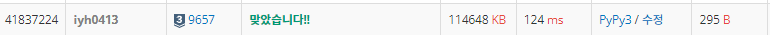

# [Baekjoon] 9657. 돌 게임 3 [S3]

## 📚 문제

https://www.acmicpc.net/problem/9657

---

## 📖 풀이

이길 수 있는지 시작부터 파악해본다.

1, 3, 4개를 가져갈 수 있다.

상근이가 이기는 경우는 o, 창영이가 이기는 경우는 x이다.

1 2 3 4 5 6 7 8 9

o x o o o o x o x 

-1, -3, -4가 다 o이면 x이다. 나머지는 o이다.

창영이가 이기는 경우는 현재 값 기준 -1, -3, -4의 값들이 o인 경우이다.

돌이 1 ~ 4 개일 때의 승리 여부를 기저 조건으로 적어주고, 탑다운 DP로 푼다.

## 📒 코드

```python
def recur(cur):
    if dp[cur] != -1:
        return dp[cur]
    dp[cur] =  not (recur(cur - 1) and recur(cur - 3) and recur(cur - 4))
    return dp[cur]


n = int(input())
dp = [-1 for _ in range(n + 4)]
dp[1] = 1
dp[2] = 0
dp[3] = 1
dp[4] = 1
if recur(n):
    print('SK')
else:
    print('CY')
```

## 🔍 결과

