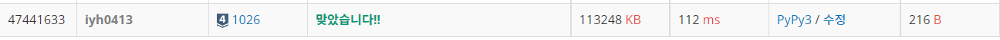

# [Baekjoon] 1026. 보물 [S4]

## 📚 문제 : [보물](https://www.acmicpc.net/problem/1026)

## 📖 풀이

총 배열의 개수는 50개 이하이다.

50개를 재배치 하는 모든 경우의 수를 세면 50!이라 시간 초과가 발생한다.

따라서 완전 탐색으로는 찾을 수 없다.

가장 큰 수에는 가장 작은 수를 곱하는 걸 반복해서 찾아준다.

따라서 B를 오름차순으로 정렬하고, A는 내림차순으로 정렬해 각각의 인덱스에 맞게 곱해준다.

B의 순서를 바꾸지 않는다고 했는데, 어차피 A의 순서를 무작위로 바꾸니 의미 없다.

따라서 그냥 하나는 오름차순, 하나는 내림차순으로 정렬해 각각의 인덱스 값을 곱하면 답이 된다.

## 📒 코드

```python
n = int(input())
arr_a = list(map(int, input().split()))
arr_b = list(map(int, input().split()))

arr_a.sort()
arr_b.sort(reverse=True)

result = 0
for i in range(n):
    result += arr_a[i] * arr_b[i]

print(result)

```

## 🔍 결과

