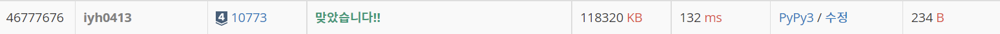

# [Baekjoon] 10773. 제로 [S4]

## 📚 문제 : [제로](https://www.acmicpc.net/problem/10773)

## 📖 풀이

스택을 활용해서 푼다.

0이 아닌 수가 나오면 스택에 수를 담고, 0이 나오면 스택에서 하나 꺼낸다.

다 확인한 후 스택에 있는 수들의 합을 출력한다.

## 📒 코드

```python
import sys
input = sys.stdin.readline

n = int(input())
stack = []
for i in range(n):
    x = int(input())
    if x:     # 0이 아닌 경우
        stack.append(x)
    else:       # 0인 경우
        stack.pop()

print(sum(stack))
```

## 🔍 결과

