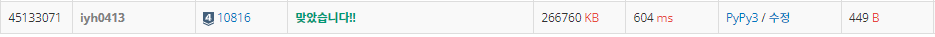

# [Baekjoon] 10816. 숫자 카드 2 [S4]

## 📚 문제 : [숫자 카드 2](https://www.acmicpc.net/problem/10816)

## 📖 풀이

숫자카드를 몇 개 가지고 있는지 구하는 문제이다.

숫자 카드의 개수가 50만이니까 일단 정렬한다.

그리고 숫자카드의 수가 천만까지이므로 그냥 카운팅 배열을 사용해도 되지만 음수도 있으므로 귀찮으니 **딕셔너리**를 사용한다.

딕셔너리를 사용할 때 `딕셔너리.get(x, 0)`으로 없으면 에러가 아니라 0을 반환하게 하여 사용하면 된다.

## 📒 코드

```python
n = int(input())        # 숫자 카드 개수
arr = list(map(int, input().split()))
visited = {}            # 딕셔너리로 선언
for x in arr:
    visited[x] = visited.get(x, 0) + 1      # 숫자 카드 개수를 더해준다.

m = int(input())        # 확인해볼 수
arr = list(map(int, input().split()))
result = []
for x in arr:
    result.append(visited.get(x, 0))        # result 배열에 출력할 값을 담아준다.

print(*result)
```

## 🔍 결과

