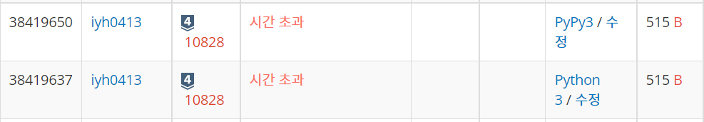

# [Baekjoon] 10828. 스택[S4]

문제: https://www.acmicpc.net/problem/10828

---

- push X: 정수 X를 스택에 넣는 연산이다.
- pop: 스택에서 가장 위에 있는 정수를 빼고, 그 수를 출력한다. 만약 스택에 들어있는 정수가 없는 경우에는 -1을 출력한다.
- size: 스택에 들어있는 정수의 개수를 출력한다.
- empty: 스택이 비어있으면 1, 아니면 0을 출력한다.
- top: 스택의 가장 위에 있는 정수를 출력한다. 만약 스택에 들어있는 정수가 없는 경우에는 -1을 출력한다.

---

하나하나 조건문으로 구현한다. 그런데 시간초과가 발생한다..

코드:

```python
N = int(input())
stack = []

for i in range(N):
    command = input().split()
    if command[0] == 'push':
        stack += [int(command[1])]
    elif command[0] == 'pop':
        if len(stack):
            print(stack[-1])
            del stack[-1]
        else: print(-1)
    elif command[0] == 'size':
        print(len(stack))
    elif command[0] == 'empty':
        if len(stack):
            print(0)
        else: print(1)
    else:
        if len(stack):
            print(stack[-1])
        else: print(-1)
```

결과:



---

input이 느려서 그런거같아서 `sys.stdin.readline`을 사용해본다.

```python
import sys
input = sys.stdin.readline

N = int(input())
stack = []

for i in range(N):
    command = input().split()
    if command[0] == 'push':
        stack += [int(command[1])]
    elif command[0] == 'pop':
        if len(stack):
            print(stack[-1])
            del stack[-1]
        else: print(-1)
    elif command[0] == 'size':
        print(len(stack))
    elif command[0] == 'empty':
        if len(stack):
            print(0)
        else: print(1)
    else:
        if len(stack):
            print(stack[-1])
        else: print(-1)
```

결과:


---

입력이 많을 땐 `import sys 	input = sys.stdin.readline`을 애용한다.

저렇게 맨 위에 써주기만 해도 input()을 똑같이 사용가능하다.