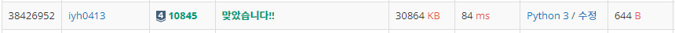

# [Baekjoon] 10845. 큐[S4]

문제: https://www.acmicpc.net/problem/10845

---

- push X: 정수 X를 큐에 넣는 연산이다.
- pop: 큐에서 가장 앞에 있는 정수를 빼고, 그 수를 출력한다. 만약 큐에 들어있는 정수가 없는 경우에는 -1을 출력한다.
- size: 큐에 들어있는 정수의 개수를 출력한다.
- empty: 큐가 비어있으면 1, 아니면 0을 출력한다.
- front: 큐의 가장 앞에 있는 정수를 출력한다. 만약 큐에 들어있는 정수가 없는 경우에는 -1을 출력한다.
- back: 큐의 가장 뒤에 있는 정수를 출력한다. 만약 큐에 들어있는 정수가 없는 경우에는 -1을 출력한다.

---

입력하는 명령이 10000개까지 들어올 수 있으니 `sys.stdin.readline()`으로 입력을 받는다.

나머지는 저번 스택 했을 때와 비슷하다.

스택 : https://velog.io/@yunhlim/Baekjoon-10828.-%EC%8A%A4%ED%83%9DS4

스택은 한쪽으로만 쌓고 넣은 쪽으로만 빼낸다면 큐는 한쪽으로 쌓고 반대쪽으로만 빼낸다!

---

코드:

```python
import sys
input = sys.stdin.readline

N = int(input())
cue = []

for _ in range(N):
    command = input().split()
    if command[0] == 'push':
        cue += [command[1]]
    elif command[0] == 'pop':
        if len(cue):
            print(cue[0])
            del cue[0]
        else:
            print(-1)
    elif command[0] == 'size':
        print(len(cue))
    elif command[0] == 'empty':
        if len(cue):
            print(0)
        else: print(1)
    elif command[0] == 'front':
        if len(cue):
            print(cue[0])
        else: print(-1)
    else:
        if len(cue):
            print(cue[-1])
        else: print(-1)
```

---

결과:

