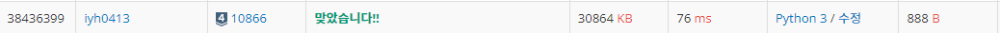

# [Baekjoon] 10866. 덱[S4]

## 📚 문제

https://www.acmicpc.net/problem/10866

---

>push_front X: 정수 X를 덱의 앞에 넣는다.
>
>push_back X: 정수 X를 덱의 뒤에 넣는다.
>
>pop_front: 덱의 가장 앞에 있는 수를 빼고, 그 수를 출력한다. 만약, 덱에 들어있는 정수가 없는 경우에는 -1을 출력한다.
>
>pop_back: 덱의 가장 뒤에 있는 수를 빼고, 그 수를 출력한다. 만약, 덱에 들어있는 정수가 없는 경우에는 -1을 출력한다.
>
>size: 덱에 들어있는 정수의 개수를 출력한다.
>
>empty: 덱이 비어있으면 1을, 아니면 0을 출력한다.
>
>front: 덱의 가장 앞에 있는 정수를 출력한다. 만약 덱에 들어있는 정수가 없는 경우에는 -1을 출력한다.
>
>back: 덱의 가장 뒤에 있는 정수를 출력한다. 만약 덱에 들어있는 정수가 없는 경우에는 -1을 출력한다.

입력이 10000개까지 들어오니 `sys.stdin.readline`을 사용한다.

앞서 풀어본 스택과 큐 자료구조와 다르게 덱(Deque)은 양쪽으로 넣고 양쪽으로 뺀다.

## 📒 코드

```python
import sys
input = sys.stdin.readline

N = int(input())
deque = []

for _ in range(N):
    command = input().split()
    
    if command[0] == 'push_front':
        deque = [command[1]] + deque
    elif command[0] == 'push_back':
        deque = deque + [command[1]]
    elif command[0] == 'pop_front':
        if len(deque):
            print(deque[0])
            del deque[0]
        else: print(-1)
    elif command[0] == 'pop_back':
        if len(deque):
            print(deque[-1])
            del deque[-1]
        else: print(-1)
    elif command[0] == 'size':
        print(len(deque))
    elif command[0] == 'empty':
        if len(deque):
            print(0)
        else: print(1)
    elif command[0] == 'front':
        if len(deque):
            print(deque[0])
        else: print(-1)
    else:
        if len(deque):
            print(deque[-1])
        else: print(-1)
```

## 🔍 결과



