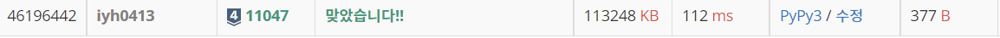

# [Baekjoon] 11047. 동전 0 [S4]

## 📚 문제 : [동전 0](https://www.acmicpc.net/problem/11047)

## 📖 풀이

가치가 여러 개인 동전이 무한대로 지급된다.

동전들의 가치가 주어지면, 최소한의 동전의 개수로 입력으로 주어진 가치를 만드는 문제이다.

가치가 큰 숫자부터 넣어주며 확인한다. 동전이 배수로 이루어져 있으니 큰 숫자부터 채울 수 있으면 채우면서 가면 되니 편하다.

답이 나온 경우 동전의 개수를 출력하고 종료한다.

## 📒 코드

```python
def recur(cur, price, total_cnt):
    if not price:
        print(total_cnt)
        exit()
    
    cnt = price // arr[cur]
    if cnt:
        recur(cur - 1, price - cnt * arr[cur], total_cnt + cnt)
    else:
        recur(cur - 1, price, total_cnt)

n, k = map(int, input().split())
arr = [0 for _ in range(n)]
for i in range(n):
    arr[i] = int(input())
recur(n - 1, k, 0)
```

## 🔍 결과

