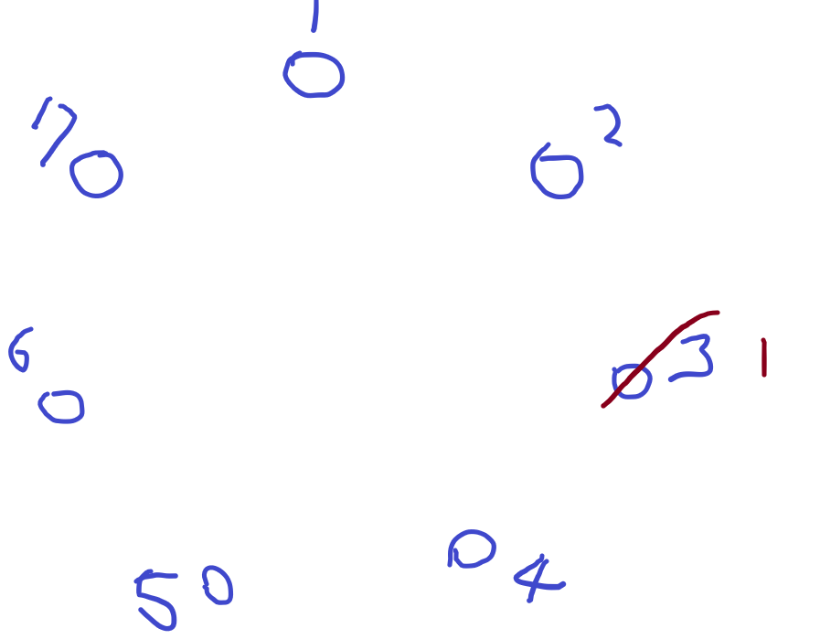
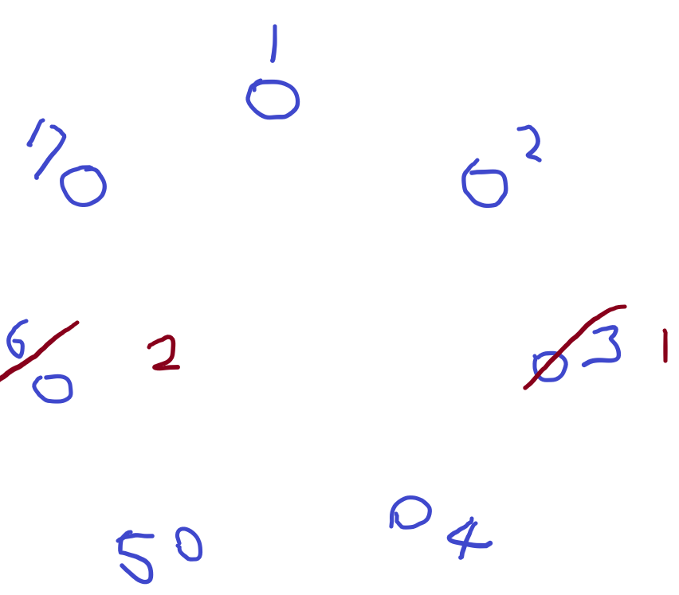
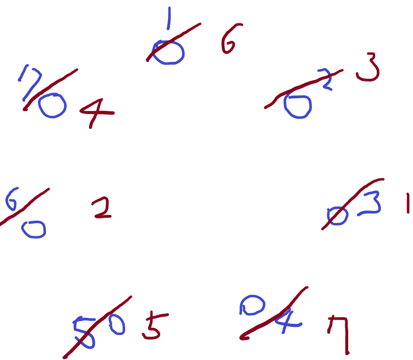
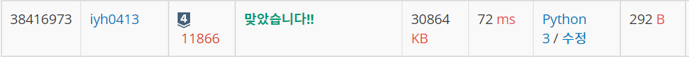

# [Baekjoon] 11866. 요세푸스 문제 0[S4]

## 📚 문제

https://www.acmicpc.net/problem/11866

---

> 요세푸스 문제: 주어진 K번째 사람을 제거한다. 제거하고 다음 사람부터 순서대로 제거하는 순열이다.

(7,3)을 그림으로 정리해보았다.

1. 7명이 원으로 앉고 3번째 사람을 제거한다. 요세푸스 순열에 넣는다. <3>

   

2. 죽인 사람부터 순차적으로 돈다. 4 5 6 세번째인 6을 제거한다. <3, 6>

   

3. 그 다음부터도 똑같이 제거한다. 수가 2이하로 남으면 서로 한 번 더 돌아 3번을 채워 제거한다. <3, 6, 2, 7, 5, 1, 4>

   

코드를 짜기 위해 입력부터 설계해본다.

>1. 입력 N을 받아 1~N의 숫자 리스트를 만든다.
>2. K번째의 숫자를 제거해야하니 제거할 index를 for문을 돌 때마다 찾아준다.
>3. K번째를 제거해야하니 K-1을 더하고 현재 사람 수 만큼으로 나눈 나머지를 index로 정한다.
>4. `pop()`메서드로 꺼내 요세푸스 list에 담고 현재 index가 1번째이니 k-1로 다시 더하면서 for문을 반복한다.
>5. 반복문을 N번 돌면서 하나씩 제거한다.

## 📒 코드

```python
N, K = map(int, input().split())
circle = list(range(1,N+1)) # 1~N으로 이루어진 리스트
result = [] # 결과를 담을 요세푸스 순열

index = 0   # 첫번째 순서
for i in range(N,0,-1):
    index += K-1    # K번째를 제거해야 하니 K-1을 더한다.
    index %= i  # 현재 사람 수로 나머지 연산을 통해 제거할 인덱스를 정확히 찾는다.
    result.append(circle.pop(index))

print(f'<{", ".join(map(str,result))}>')    # join과 map함수로 문자열의 모양을 원하는 출력 형태로 바꾼다.
```

## 🔍 결과



