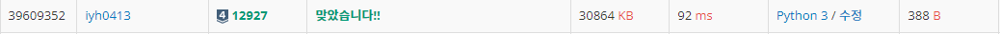

# [Baekjoon] 12927. 배수 스위치 [S4]

## 📚 문제

https://www.acmicpc.net/problem/12927

---

전구가 1 ~ N개가 나열되어 있다. 켜져있는 상태는 랜덤이다.

스위치도 1 ~ N개가 있는데 i번째 스위치를 누르면 i의 배수 스위치는 모두 바뀌게 된다.

위 과정으로 다 꺼야하므로 1부터 순서대로 스위치가 켜져있는지 확인한다.

켜져있으면 차례대로 꺼주는 작업을 반복한다.

처음 index를 1로 잡고 옆으로 이동하면서 1일 때마다 그 때의 배수 스위치를 반전시켜준다.

## 📒 코드

```python
arr = list(input())
for i in range(len(arr)):   # Y는 1로 N은 0으로 바꾼다.
    if arr[i] == 'Y':
        arr[i] = 1
    else:
        arr[i] = 0
arr = [0] + arr     # 1 ~ N개이므로 0을 앞에 붙여준다.

cnt = 0             # 스위치 누른 횟수
s = 1               # 현재 확인하는 인덱스
while s < len(arr): # s를 1부터 옆으로 이동시키며 확인한다.
    if arr[s] == 1: # s가 1일 때만 스위치를 누른다.
        cnt += 1    # 스위치 누른 횟수 +1
        for i in range(s, len(arr)):
            if i % s == 0:  # 현재 인덱스가 s의 배수일 때
                arr[i] = 1 ^ arr[i]     # xor연산자로 스위칭
    s += 1          # 확인 했으면 옆으로 이동한다.

print(cnt)
```

## 🔍 결과

