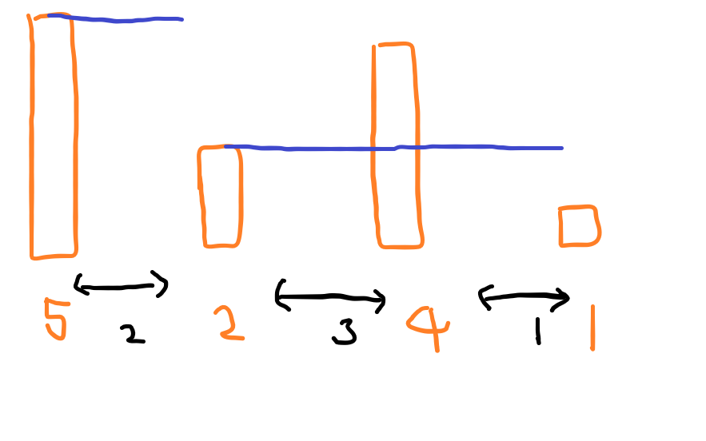
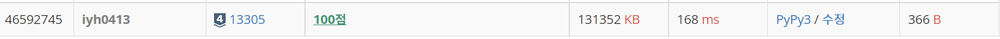

# [Baekjoon] 13305. 주유소 [S4]

## 📚 문제 : [주유소](https://www.acmicpc.net/problem/13305)

## 📖 풀이

최대 주유 금액은 없다.

현재 주유소가 지금까지 나온 주유소 중 리터 당 주유금액이 최소이면 더 작은 주유소가 나올 때까지 주유하면 된다.

즉 최소 값을 찾으며 나올 때까지 거리 값을 곱해주면 된다.

예제로 설명해본다.

- input

```
4
2 3 1
5 2 4 1
```

먼저 도시의 개수가 주어진다. 도시의 개수는 4이다.

그리고 각 도시 사이의 거리가 순서대로 주어진다.

그 다음 줄에는 주유소의 리터 당 주유금액이다.

그림으로 그리면 다음과 같이 그릴 수 있다.



파란색이 현재까지 나온 최소 리터 당 주유금액이다.

그러면 5원일 때 2km가고 2원으로 4km 가니까 총 18원을 쓰게 된다.

## 📒 코드

```python
n = int(input())
dist = list(map(int, input().split()))
cost = list(map(int, input().split()))

min_cost = 1_000_000_000    # 현재까지의 최소 값을 저장한다.(초기화는 나올 수 있는 가장 큰 수로 초기화)

result = 0
for i in range(n - 1):
    if cost[i] < min_cost:
        min_cost = cost[i]
    result += dist[i] * min_cost

print(result)
```


## 🔍 결과

