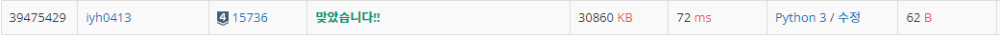

# [Baekjoon] 15736. 청기 백기 [S4]

## 📚 문제

https://www.acmicpc.net/problem/15736

---

청기백기 깃발 중 청색을 0, 백색을 1이라고 한다.

먼저 N개만큼 0으로 나열되어있으면 1,2,3,~,N의 배수를 순서대로 깃발을 뒤집는다.

최종적으로 1의 총 개수를 출력한다.

**N의 개수는 21억으로 주어졌다.** 하나씩 탐색하거나 배열에 담아 찾는 방법이 아니다.

small case로 10개를 한번 찾아본다.

| 1    | 2    | 3    | 4    | 5    | 6    | 7    | 8    | 9    | 10   |
| ---- | ---- | ---- | ---- | ---- | ---- | ---- | ---- | ---- | ---- |
| 1    | 0    | 0    | 1    | 0    | 0    | 0    | 0    | 1    | 0    |

약수만큼 뒤집어지는데 홀수로만 뒤집어지는 경우의 수를 찾는 것이니 **제곱수**를 찾으면 된다.

> m<sup>2</sup> < N

위 조건을 만족시키는 m 값을 출력한다.

## 📒 코드

```python
N = int(input())
m = 1
while m * m <= N:
    m += 1
print(m-1)
```

## 🔍 결과



푸는 방법만 알면 엄청 간단한 코드..