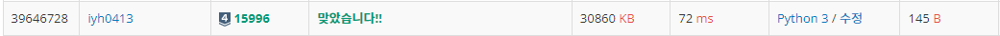

# [Baekjoon] 15996. 팩토리얼 나누기 [S4]

## 📚 문제

https://www.acmicpc.net/problem/15996

---

N! 를 소수 A의 k 제곱으로 나누었을 때 나머지가 0이 되는 정수 k를 구하는 문제이다.

1 ~ N에 A의 배수가 몇 번 나오는지 확인한다.

N을 A로 나누면 A의 배수의 개수를 구할 수 있다.

> N 이하의 A의 배수의 개수 : `N // A`

N을 A로 두번 나눈 몫을 구하면 A^2의 배수를 구한다.

위 과정을 반복하면서 N//A가 A보다 작아지면 시행을 그만둔다.

## 📒 코드

```python
n, a = map(int, input().split())
m = n // a  # a의 배수의 개수
cnt = m     # cnt는 a의 배수의 개수를 담는다.

# cnt에 A의 배수의 개수를 담고
# 반복문 한 번 시행 : A^2의 배수의 개수를 담고
# 반복문 두 번 시행 : A^3의 배수의 개수를 담는다.
# 반복문 N 번 시행 : A^N의 배수의 개수를 담는다.
# 위 반복문을 반복해 A의 총 누적곱을 담는 것이다.
while m >= a:
    m //= a     # 반복문을 시행할수록 a^(시행횟수+1)의 배수의 개수
    cnt += m

print(cnt)
```

## 🔍 결과

