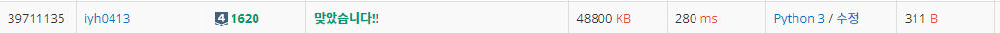

# [Baekjoon] 1620. 나는야 포켓몬 마스터 이다솜 [S4]

## 📚 문제

https://www.acmicpc.net/problem/1620

---

n, m이 100000이다. n과 m의 입력만큼 나누어서 입력이 들어오니 input()으로 하면 시간초과가 발생한다.

따라서 readline()을 사용한다.

여기서 그냥 readline()을 사용하면 개행문자가 함께 섞여오니 rstrip()으로 개행문자를 제거해준다.

list로만 입력을 받아 for문으로 값을 찾아주면 100000 * 100000이라 시간초과가 발생하게 되니 입력 받을 때부터 list와 dictionary로 받아준다.

list로 받는건 입력받은 것이 숫자일 경우 문자를 출력하기 위함이고, dictionary는 문자를 입력받을 때 숫자를 출력하기 위함이다.

## 📒 코드

```python
import sys

n, m = map(int, input().split())
arr = [0]   # 숫자를 입력 받아 문자를 출력하기 위한 리스트
dic = {}    # 문자를 입력받아 숫자를 출력하기 위한 리스트
for i in range(1, n+1):
    temp = sys.stdin.readline().rstrip()    # 도감을 입력 받는다.
    arr.append(temp)    # index값에 대한 입력 문자를 list에 넣어준다.
    dic[temp] = i       # key에는 입력 문자를 값에는 index를 입력해준다.
for _ in range(m):
    key = sys.stdin.readline().rstrip()     # 문제를 하나씩 꺼낸다.
    if key.isdigit():                       # 숫자가 나오면 list를 활용해 문자를 찾아준다.
        print(arr[int(key)])
    else:
        print(dic[key])                     # 문자가 나오면 dictionary를 활용해 index를 찾아준다.
```

## 🔍 결과

