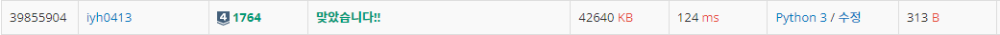

# [Baekjoon] 1764. 듣보잡 [S4]

## 📚 문제

https://www.acmicpc.net/problem/1764

---

듣도 못한 사람 N명이 먼저 한 줄씩 입력된다. 그리고 나머지 M명이 입력된다.

둘다 50만 이하이니 총 100만의 입력이 들어가게된다. 따라서 readline을 사용해야 한다.

set 함수를 사용해 N명을 담아주고 M명을 담아준다. 그리고 교집합 연산자를 활용해 듣보잡을 찾는다. list로 바꾸고 정렬하여 사전순으로 출력시킨다.

## 📒 코드

```python
import sys

n, m = map(int, input().split())    # 듣도 못한 사람의 수 n, 보도 못한 사람의 수 m
n_set = set()   # 듣도 못한 사람들을 담을 set
m_set = set()   # 보도 못한 사람들을 담을 set
result = []     # 듣보잡들을 담을 list

for i in range(n):  # 듣도 못한 사람들을 담는다.
    n_set.add(sys.stdin.readline().rstrip())

for i in range(m):  # 보도 못한 사람들을 담는다.
    m_set.add(sys.stdin.readline().rstrip())

result = list(n_set & m_set)    # set의 교집합 연산자를 사용한다.
result.sort()                   # 사전순으로 정렬
print(len(result))              # 듣보잡들의 수 출력
for name in result:             # 듣보잡들을 출력
    print(name)
```

## 🔍 결과



