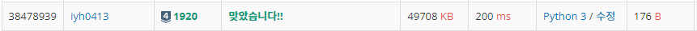

# [Baekjoon] 1920. 수 찾기[S4]

문제: https://www.acmicpc.net/problem/1920

---

첫째줄은 A라는 리스트의 길이이고 둘째줄은 A의 원소들이다.

셋째줄은 넷째줄의 개수이고 넷째줄의 각각이 A 안에 존재하는지 출력하면된다.

코드:

```python
N = int(input())
A = list(map(int,input().split()))
M = int(input())
nums = list(map(int,input().split()))

for num in nums:
    if num in A:
        print(1)
    else: print(0)
```

결과:


시간초과가 발생한다.

python3에서 시간초과가 발생하여 pypy3로 해결했다.

결과:


---

---

그렇지만 시간이 4800ms나 나와 겨우 통과했지만 좀 더 빠르게 푸는 방법을 알아본다.

A는 비교하기만 하고 순서는 중요하지 않으니 **Set** 자료형으로 바꾼다.

코드:

```python
N = int(input())
A = set(map(int,input().split()))	# list에서 set로 변경
M = int(input())
nums = list(map(int,input().split()))

for num in nums:
    if num in A:
        print(1)
    else: print(0)
```

결과:



시간이 20배 이상 단축됐다. Set 자료형을 사용해서 해결할 수 있을 땐 List 자료형 말고 Set 자료형을 우선적으로 생각해보자~!